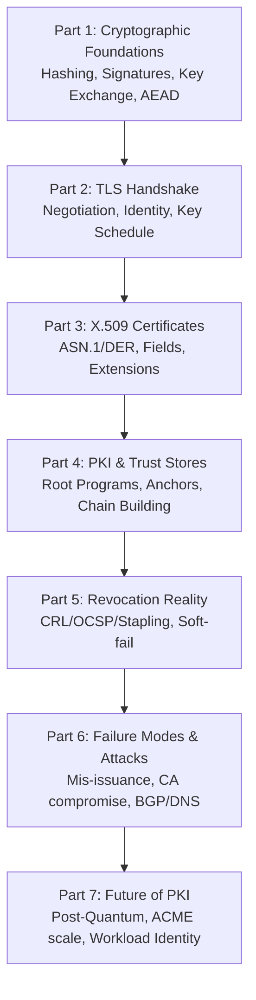
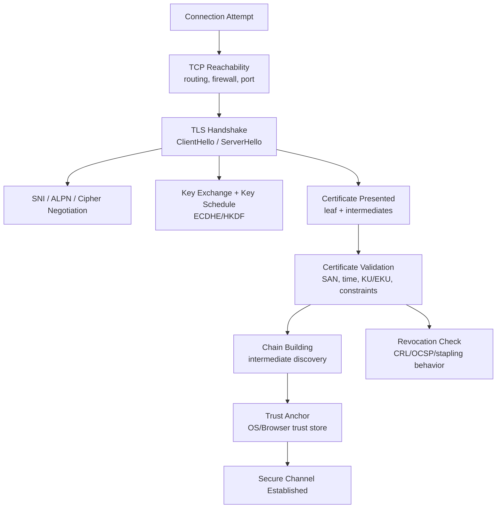
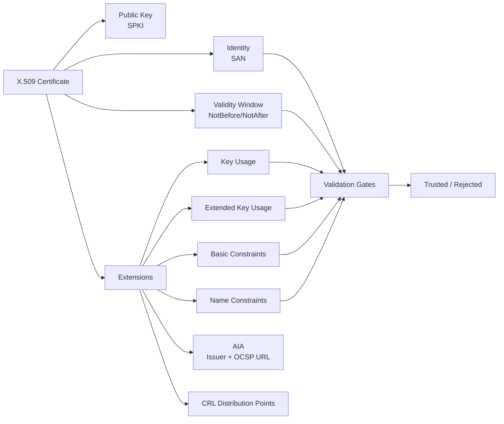
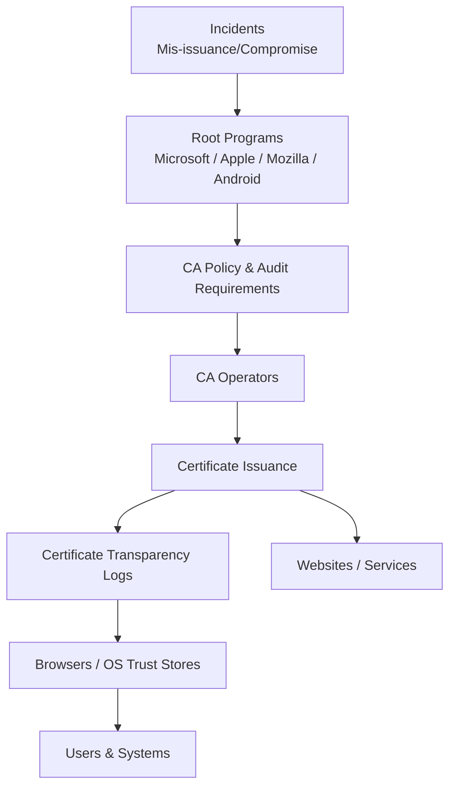
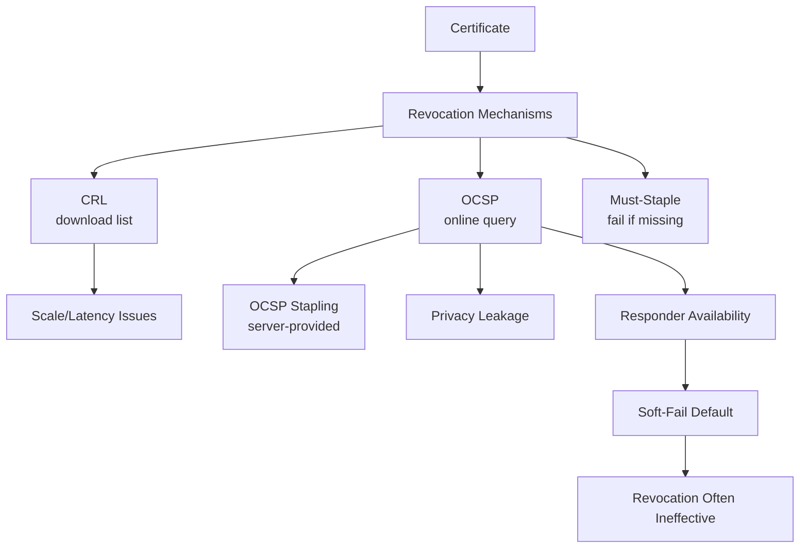
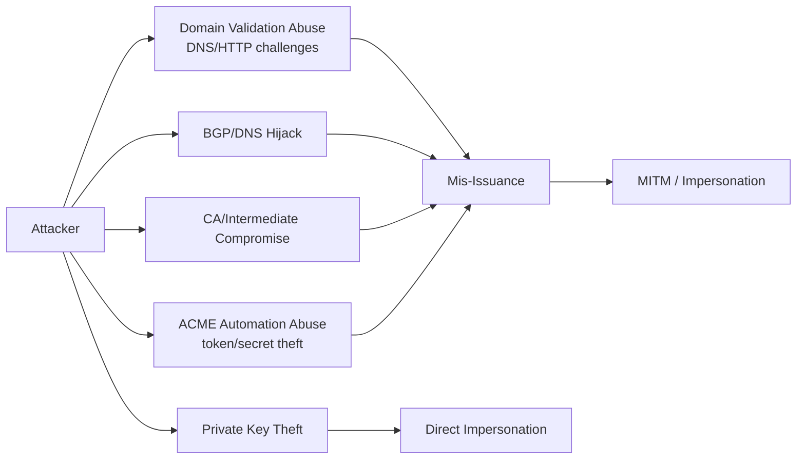
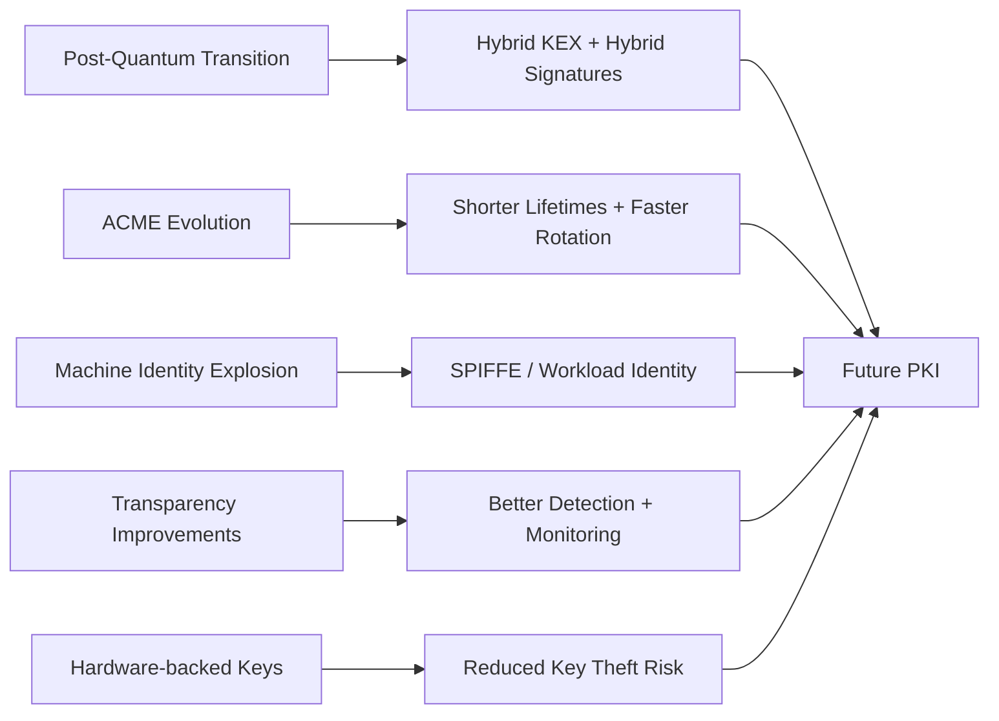

# Certificate Infrastructure Deep Dive
## Architecture Map (Parts 1–7)

This page provides a **visual architecture map** of the full series, showing how each part fits into the broader certificate infrastructure story.

If you want one mental model to keep in your head when troubleshooting TLS/PKI, this is it.

---

## 1. End-to-End Trust Architecture (Big Picture)

---

## 2. From Wire to Root (Operational Debug View)

This diagram maps the path an engineer mentally follows when debugging a “TLS is broken” incident.

Where the series fits:
- **Part 2** explains the handshake stage.
- **Part 3** explains certificate structure and extensions.
- **Part 4** explains chain building and trust anchors.
- **Part 5** explains revocation and why it fails.

---

## 3. Certificate Anatomy and Validation Gates

This map shows the most important certificate components and where they influence validation decisions.

Series mapping:
- **Part 3** is the deep dive on every node in this diagram.

---

## 4. Global Trust Governance Map

This map shows how “trust” is distributed globally through root programs, audits, and transparency.

Series mapping:
- **Part 4** explains the governance and trust distribution model.
- **Part 6** explains how incidents feed back into governance decisions.

---

## 5. Revocation Reality Map (Why It’s Weak)

This is the “security vs availability” trade-off visualized.

Series mapping:
- **Part 5** is the deep dive on this entire diagram.

---

## 6. Attack Surface Map

This shows where attackers target the certificate ecosystem.

Series mapping:
- **Part 6** explores these failures and realistic mitigations.
- **Part 4** explains why governance is needed at all.
- **Part 5** explains why revocation rarely stops attacks quickly.

---

## 7. Future Trajectory Map

This shows the major trends shaping the next iteration of PKI.

Series mapping:
- **Part 7** is the deep dive on these trends.

---

## How to Use This Map

When troubleshooting:
1. Start at the **Wire-to-Root** map.
2. Identify which layer is failing.
3. Drill into the corresponding series part.

When designing infrastructure:
1. Use **Global Governance** + **Attack Surface** maps to assess systemic risk.
2. Use **Future Trajectory** map to design for the next 3–5 years.

