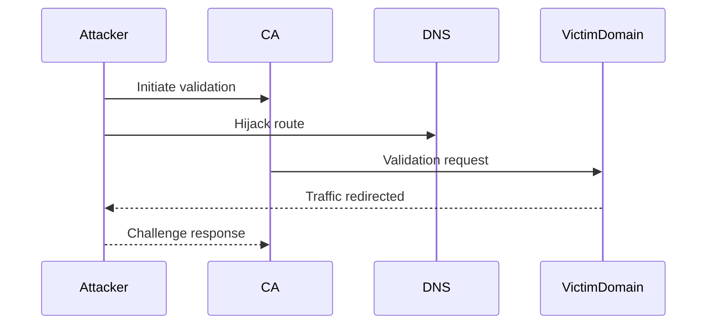
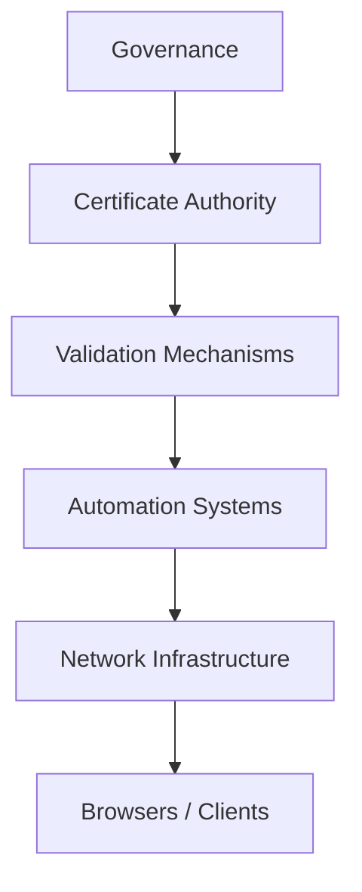

# Certificate Infrastructure Deep Dive — Part 6
## Certificate Mis-Issuance, Attacks, and Real-World Failure Modes

In Part 5, we examined revocation and why it struggles at internet scale.

Now we examine the uncomfortable reality:

> What happens when the trust system itself fails?

This article explores real-world PKI failure modes, attack paths, and structural weaknesses in certificate ecosystems.

---

# 1. What Is Certificate Mis-Issuance?

Certificate mis-issuance occurs when a Certificate Authority (CA):

- Issues a certificate to the wrong party
- Fails domain validation correctly
- Violates policy requirements
- Is compromised by an attacker

Because browsers trust root CAs globally, a single mis-issued certificate can impact millions of users.

---

# 2. The Domain Validation Weakness

Most public TLS certificates rely on Domain Validation (DV).

DV proves control of a domain via:

- HTTP challenge
- DNS challenge
- Email challenge

Weaknesses include:

- DNS hijacking
- BGP route manipulation
- Compromised DNS providers
- Shared hosting vulnerabilities

If an attacker temporarily controls validation infrastructure, they may obtain a legitimate certificate.

---

# 3. BGP Hijacking Attack Vector

Border Gateway Protocol (BGP) controls internet routing.

If an attacker:

1. Hijacks IP space for a domain
2. Redirects validation traffic
3. Responds correctly to ACME challenge

They can obtain a valid certificate.

This attack has occurred in real-world incidents.

---

# 4. CA Compromise

If a CA's private key is compromised:

- Attackers can issue arbitrary certificates
- Browsers will trust them
- Revocation becomes reactive

Historical examples include:

- Compromised intermediate CAs
- Unauthorized certificate issuance for major domains

Mitigation often involves:

- Emergency root removal
- Revocation of intermediate
- Browser updates

---

# 5. Rogue or Malicious CA Risk

Not all failure is technical.

Some risks include:

- State-influenced CAs
- Weak audit enforcement
- Insider threats
- Governance failures

Root programs rely heavily on audits and compliance frameworks, but audits are periodic — not continuous.

Trust is policy-enforced, not mathematically guaranteed.

---

# 6. Certificate Transparency as a Defense

Certificate Transparency (CT) mitigates silent mis-issuance.

All publicly trusted certificates must be logged.

Security teams can monitor CT logs to detect:

- Unexpected certificates
- Lookalike domains
- Unauthorized issuance

However:

- Detection still occurs after issuance
- Response requires coordination

CT improves visibility — not prevention.

---

# 7. Private Key Compromise

If a private key is leaked:

- TLS sessions can be impersonated
- MITM attacks become possible

Detection mechanisms include:

- Certificate pinning
- CT monitoring
- Rapid revocation

But as discussed in Part 5:

Revocation propagation is imperfect.

---

# 8. Certificate Pinning (and Its Demise)

Public Key Pinning (HPKP) attempted to:

- Restrict acceptable public keys
- Prevent rogue CA attacks

Problems:

- Risk of self-bricking domains
- Operational fragility
- Complexity

Browsers largely removed HPKP.

Modern alternatives:

- CT monitoring
- Expect-CT
- Automated scanning

---

# 9. Supply Chain and ACME Automation Risks

Automation reduces human error but introduces:

- Credential leakage risk
- Compromised automation agents
- API abuse

ACME clients must be secured like production secrets.

Automation increases scale — and scale increases attack surface.

---

# 10. Enterprise PKI Failure Modes

Internal PKI risks include:

- Overly permissive templates
- Unrestricted enrollment agents
- Weak key protection
- Shadow subordinate CAs
- Misconfigured name constraints

Compromise of an internal issuing CA can:

- Enable domain admin impersonation
- Enable smart card abuse
- Undermine Zero Trust posture

---

# 11. Real-World Lessons

Repeated themes in PKI incidents:

- Trust is centralized
- Validation is brittle
- Revocation is slow
- Governance lags technical change
- Monitoring is critical

The weakest link is often:

Operational process — not cryptography.

---

# 12. The Systemic Risk Model

PKI risk is systemic.

Failure in any layer can compromise trust.

Security depends on the entire stack functioning correctly.

---

# 13. What Actually Protects Us

Despite weaknesses, modern PKI is strengthened by:

- Short certificate lifetimes
- Mandatory CT logging
- Independent monitoring ecosystems
- Rapid browser root updates
- Increasing automation discipline

Trust is increasingly:

- Transparent
- Observable
- Continuously audited

---

# 14. The Hard Reality

No certificate system can be perfectly secure.

PKI works because:

- Attacks are detectable
- Ecosystem response is coordinated
- Compromise is costly and visible

The strength of modern PKI lies not in perfection — but in resilience.

---

PKI is not static infrastructure.
It is an evolving global trust fabric — shaped by attacks, policy, and engineering trade-offs.
