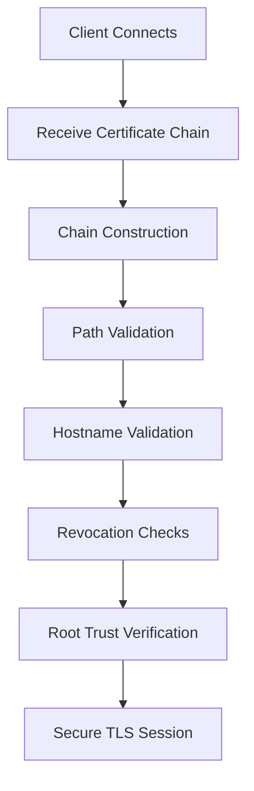

# Certificates Explained Properly

TLS certificates are often treated as simple configuration files that “make HTTPS work”.
In reality they are part of a large and carefully engineered trust system known as the **Web Public Key Infrastructure (Web PKI)**.

A single TLS connection involves multiple layers of validation including:

- certificate structure parsing
- chain construction
- RFC-defined validation algorithms
- hostname verification
- trust store governance
- revocation mechanisms

This article provides a **high‑level overview of each component**, with links to deeper technical explanations for engineers who want to explore the mechanics in detail.

---

# The Conceptual Model of Certificates

At a conceptual level, an X.509 certificate is a **signed binding between an identity and a public key**.

```
Identity + Public Key + Issuer Signature
```

The certificate authority (CA) verifies the identity of the subject and signs the certificate, allowing clients to trust that the public key belongs to the entity named in the certificate.

➡️ Deep dive: [The Conceptual Model of Certificates](/blog/conceptual-model-of-certificates.html)

---

# ASN.1 — Abstract Syntax Notation One

Certificates are defined using **ASN.1**, a structured data description language used in many networking protocols.

ASN.1 defines the schema of the certificate, while **DER (Distinguished Encoding Rules)** defines the exact binary encoding used for transmission and signing.

Because certificate signatures operate on the **DER‑encoded bytes**, deterministic encoding is essential for cryptographic verification.

➡️ Deep dive: [ASN.1 and DER Encoding](/blog/asn-1-and-der-encoding.html)

---

# Certificate Fields

An X.509 certificate contains multiple fields that influence how TLS clients interpret and validate the certificate.

Common fields include:

- Version
- Serial Number
- Signature Algorithm
- Issuer
- Validity Period
- Subject
- Subject Public Key Info
- Extensions

These fields define identity information, cryptographic parameters, and policy constraints used during certificate validation.

➡️ Deep dive: [Certificate Field Deep Dive](/blog/certificate-field-deep-dive.html)

---

# Subject Public Key Info (SPKI)

The **Subject Public Key Info (SPKI)** section contains the public key associated with the certificate subject.

This public key is used during the TLS handshake to verify signatures produced by the server's private key.

SPKI also defines the algorithm used by the key, such as:

- RSA
- ECDSA
- EdDSA

➡️ Deep dive: [Subject Public Key Info (SPKI) Deep Dive](/blog/subject-public-key-info-deep-dive.html)

---

# Certificate Extensions

Modern certificates rely heavily on **extensions**, introduced in X.509 version 3.

Important extensions include:

- **Subject Alternative Name (SAN)** – defines valid hostnames
- **Key Usage (KU)** – restricts cryptographic operations
- **Extended Key Usage (EKU)** – defines application purposes
- **Basic Constraints** – indicates whether the certificate is a CA
- **Name Constraints** – restricts subordinate CA scope

Incorrect extension configuration is one of the most common causes of TLS validation failures.

➡️ Deep dive: [Certificate Extensions Deep Dive](/blog/certificate-extensions-deep-dive.html)

---

# Certificate Chain Building Algorithms

Servers typically present only part of the certificate chain during TLS handshakes.

The client must construct a valid chain from the leaf certificate to a trusted root certificate.

This process may involve:

- intermediate certificates
- cross‑signed roots
- alternate trust paths
- Authority Information Access (AIA) fetching

➡️ Deep dive: [Certificate Chain Building Algorithms](/blog/certificate-chain-building-algorithms.html)

---

# RFC 5280 Path Validation Algorithm

Once a chain is constructed, it must be validated according to **RFC 5280**.

Validation enforces rules including:

- signature verification
- certificate validity periods
- Basic Constraints
- Key Usage and Extended Key Usage
- Name Constraints
- certificate policies
- path length constraints

➡️ Deep dive: [RFC 5280 Path Validation Algorithm](/blog/rfc5280-path-validation-algorithm.html)

---

# Hostname Validation (RFC 6125)

Certificate validation alone does not prove the identity of the server.

Hostname validation ensures the certificate actually represents the domain the client intended to connect to.

This process compares the requested hostname with entries in the **Subject Alternative Name (SAN)** extension.

➡️ Deep dive: [Hostname Validation (RFC 6125)](/blog/hostname-validation-rfc6125.html)

---

# Trust Stores and Root Programs

Certificate validation ultimately terminates at a **trusted root certificate**.

Root certificates are distributed through platform‑specific trust stores maintained by:

- Mozilla
- Microsoft
- Apple
- Google (Android)

These organizations operate **root programs** that determine which certificate authorities are trusted globally.

➡️ Deep dive: [Trust Stores and Root Programs](/blog/trust-stores-and-root-programs.html)

---

# Revocation Reality

Certificates sometimes need to be invalidated before expiration.

Revocation mechanisms include:

- Certificate Revocation Lists (CRL)
- Online Certificate Status Protocol (OCSP)
- OCSP Stapling

However, revocation has historically been unreliable due to:

- network dependencies
- latency
- privacy concerns
- soft‑fail behavior

➡️ Deep dive: [Revocation Reality](/blog/revocation-reality.html)

---

# The TLS Trust Pipeline

All of these mechanisms combine into a single trust pipeline executed during the TLS handshake.



A failure at any stage terminates the connection.

Understanding this pipeline allows engineers to diagnose TLS failures and evaluate the security posture of systems they operate.

➡️ Deep dive: [The TLS Trust Pipeline (Conclusion)](/blog/tls-trust-pipeline.html)

---

# Final Thoughts

TLS certificates represent far more than a simple encryption configuration.

They are part of a globally distributed trust architecture built on:

- cryptography
- governance
- protocol standards
- operational policy

By understanding the mechanics of certificate validation, engineers gain the ability to:

- debug TLS failures
- evaluate PKI risks
- design secure infrastructure
- build better security tooling

The goal of this series is to make TLS certificate infrastructure **transparent and understandable rather than opaque and mysterious**.
