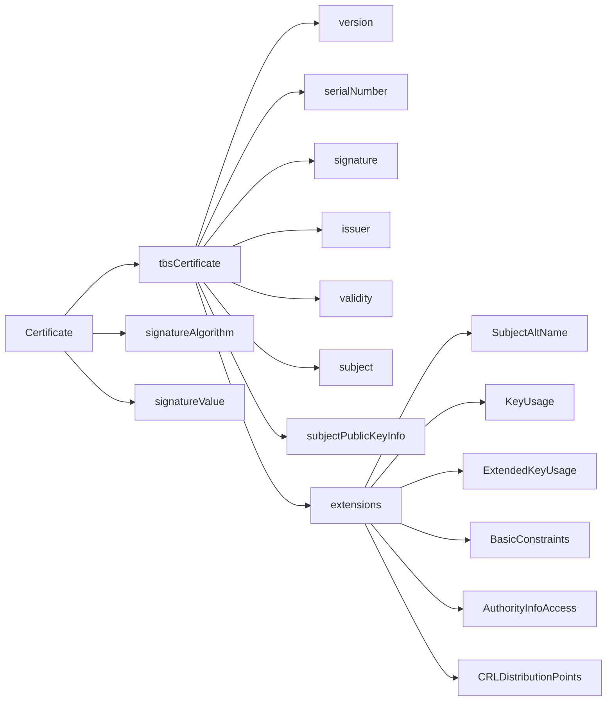
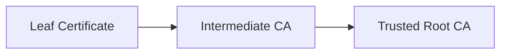

# Certificate Infrastructure Deep Dive — Part 3
## X.509 Certificates Explained Properly

In Part 2, we dissected the TLS handshake.
Now we zoom in on the object at the centre of that handshake:

> The X.509 certificate.

This article focuses on structure, validation mechanics, and how trust is actually enforced in modern PKI.

---

# 1. ASN.1 Structure (Visualised)

X.509 certificates are defined in ASN.1 and encoded using DER.
At a structural level, a certificate looks like this:



`tbsCertificate` means **“To Be Signed”** — this is the exact DER-encoded structure the issuing CA signs.

---

# 2. Real Certificate Walkthrough (Line-by-Line)

Below is a trimmed and annotated example produced using:

```bash
openssl x509 -in cert.pem -text -noout
```

---

## Example Decoded Certificate

```text
Certificate:
    Data:
        Version: 3 (0x2)
        Serial Number:
            03:7a:bf:91:ac:21:8c:42
        Signature Algorithm: sha256WithRSAEncryption
        Issuer: C=US, O=Example CA, CN=Example Intermediate CA
        Validity
            Not Before: Feb  1 00:00:00 2026 GMT
            Not After : May  1 23:59:59 2026 GMT
        Subject: CN=example.com
        Subject Public Key Info:
            Public Key Algorithm: rsaEncryption
                RSA Public-Key: (2048 bit)
        X509v3 extensions:
            X509v3 Subject Alternative Name:
                DNS:example.com, DNS:www.example.com
            X509v3 Key Usage: critical
                Digital Signature, Key Encipherment
            X509v3 Extended Key Usage:
                TLS Web Server Authentication
            X509v3 Basic Constraints:
                CA:FALSE
```

---

## Field Analysis

### Version: 3

Required for extensions.
Modern certificates must be v3.

---

### Serial Number

Unique per issuing CA.
Used for revocation and audit tracking.

Must be unpredictable to prevent collision attacks.

---

### Signature Algorithm

This indicates how the **issuer signed the certificate**, not how TLS encrypts traffic.

Example:

- sha256WithRSAEncryption
- ecdsa-with-SHA256

---

### Issuer

The Distinguished Name (DN) of the CA.

Used during chain building — must match the Subject of the issuing certificate.

---

### Validity

NotBefore / NotAfter define the trust window.

Clock skew frequently causes production TLS failures.

Modern best practice:

- Short-lived certificates
- Automated renewal

---

### Subject

Historically used for identity.

Modern TLS stacks validate against **SAN**, not CN.

---

### Subject Public Key Info (SPKI)

Contains:

- Algorithm identifier
- Public key bits

This is the key used during TLS handshake verification.

---

### Subject Alternative Name (SAN)

Authoritative identity list.

If the hostname is not present in SAN → validation fails.

Examples:

- DNS entries
- IP addresses
- URIs (e.g., SPIFFE)

---

### Key Usage (KU)

Defines allowed cryptographic operations.

For TLS servers, must include:

- Digital Signature

CA certificates must include:

- keyCertSign

---

### Extended Key Usage (EKU)

Defines application-level purpose.

For HTTPS:

- serverAuth

If EKU exists and does not include serverAuth → handshake fails.

---

### Basic Constraints

Defines whether the certificate is a CA.

CA:FALSE → End-entity certificate
CA:TRUE → Can sign other certificates

This is critical during path validation.

---

# 3. ASN.1 Deep Dive (Optional Advanced View)

Using:

```bash
openssl asn1parse -in cert.pem
```

Example output:

```text
  0:d=0  hl=4 l=1187 cons: SEQUENCE
  4:d=1  hl=4 l= 907 cons: SEQUENCE
  8:d=2  hl=2 l=   3 cons: cont [ 0 ]
  ...
```

Key ASN.1 concepts:

- SEQUENCE → ordered structure
- OBJECT IDENTIFIER → identifies algorithms/extensions
- BIT STRING → public key data
- OCTET STRING → extension payloads
- Context-specific tags (e.g., [0], [3])

DER encoding is strict and deterministic — this prevents signature ambiguity.

---

# 4. Chain Building Visualised

During validation, the client builds a trust chain:



Validation requires:

- Signature verification at each level
- Correct BasicConstraints
- Proper KeyUsage
- Valid time window
- Trusted root anchor

---

# 5. Path Validation Rules (What Actually Gets Checked)

Clients validate:

- Signature correctness
- Validity period
- Key Usage compatibility
- Extended Key Usage compatibility
- Basic constraints
- Name constraints (if present)
- Policy constraints (rare)
- Revocation status (implementation dependent)

Failure at any step aborts trust.

---

# 6. Revocation Reality

Certificates may be revoked via:

- CRL
- OCSP
- OCSP stapling

However:

- Many clients soft-fail
- Revocation is unreliable at internet scale
- Short-lived certificates are increasingly preferred

Revocation is a detection mechanism, not a strong prevention layer.

---

# 7. Common Misconceptions

### “The certificate encrypts traffic.”

False.
It authenticates identity and enables key agreement.

---

### “If it’s signed, it’s automatically safe.”

Only if:

- The issuer is trusted
- The chain validates
- Extensions are compatible
- The private key is secure

---

X.509 complexity does not come from cryptography alone.
It comes from validation logic, ecosystem trust models, and policy enforcement.
