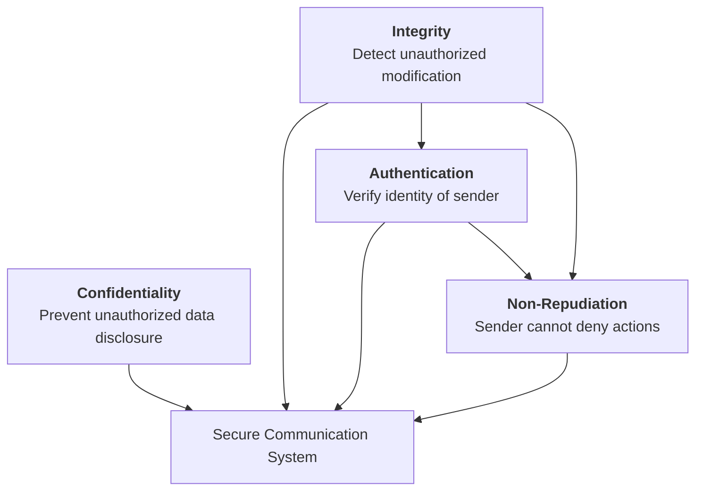
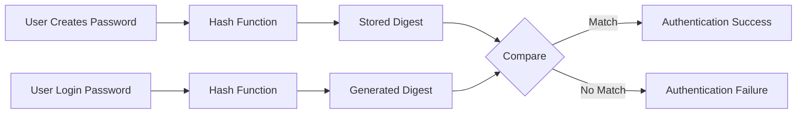
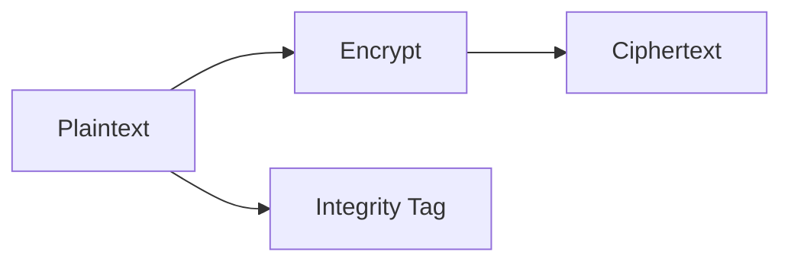
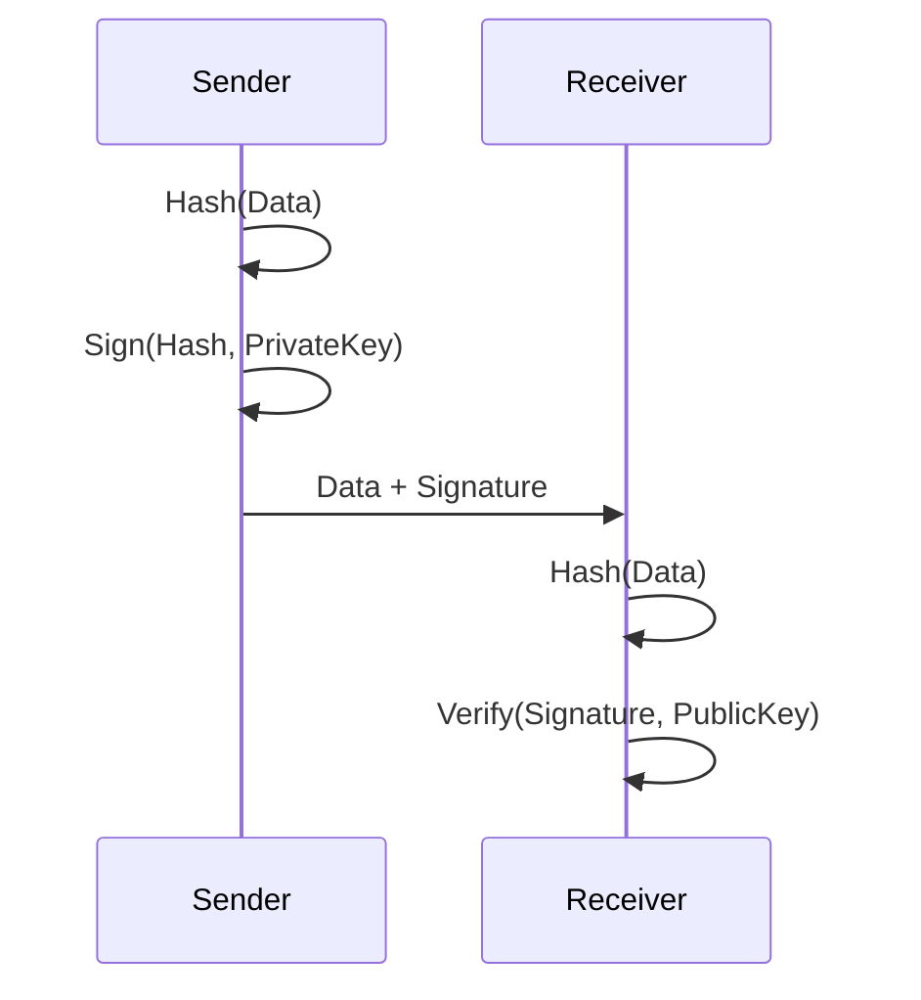
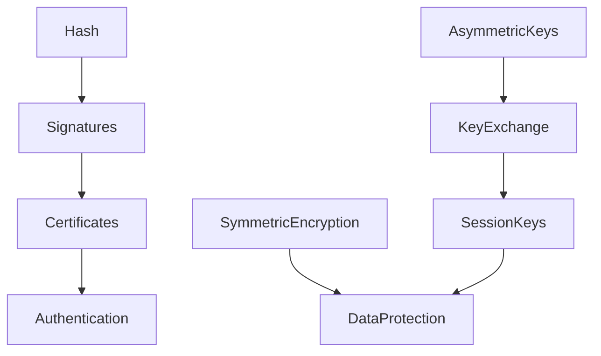

# The Cryptographic Foundations — Primitives

> **Series:** TLS & Certificate Infrastructure Deep Dive

Modern secure communication systems are built from a small number of cryptographic primitives.
Protocols like TLS, certificate infrastructures, and PKI ecosystems do not invent new cryptography. Instead, they combine well‑understood primitives in carefully designed ways.

This article explores those primitives — **hashing, symmetric encryption, asymmetric cryptography, digital signatures, and authenticated encryption** — and explains why they exist and how they behave in real systems.

Understanding these building blocks is essential before examining the TLS handshake, certificate chains, and PKI trust models in later parts of this series.

---

# 1. Why Cryptography Exists in Modern Systems

Cryptographic systems attempt to provide four primary guarantees:

| Objective | Purpose |
|-----------|--------|
| Confidentiality | Prevent unauthorized parties from reading data |
| Integrity | Detect whether data has been modified |
| Authentication | Verify the identity of communicating parties |
| Non‑repudiation | Prevent a sender from denying an action they performed |

Cryptographic systems are designed to achieve several core security objectives. These goals are often presented independently, but in practice they interact and depend on each other.

For example:
- Encryption alone provides confidentiality but **not** integrity.
- Integrity verification does **not** guarantee who created the data.
- Authentication does **not** prevent data disclosure.

Secure systems therefore combine cryptographic primitives to achieve multiple objectives simultaneously.

The following diagram illustrates the relationship between the four primary goals of cryptography.



Modern protocols combine primitives to achieve these goals simultaneously.

TLS is an example of such a hybrid system.

## Confidentiality

Confidentiality ensures that information can only be read by authorized parties.

This is typically achieved using encryption.

Example mechanisms:
- AES-GCM
- ChaCha20-Poly1305
- Disk encryption systems such as BitLocker
- TLS encrypted sessions

Example scenario:

A user logs into a website. Their credentials travel across the network inside an encrypted TLS connection. Anyone intercepting the traffic sees only ciphertext.

However, confidentiality alone does not guarantee that the data has not been modified.

## Integrity

Integrity ensures that data has not been altered during transmission or storage.

This is typically achieved using:
- cryptographic hashes
- message authentication codes
- digital signatures

Example:

```
Original message → Hash → Digest
Received message → Hash → Digest
```

If the digests match, the message is considered unchanged.

Integrity is critical in systems like:
- TLS handshake transcript validation
- software update verification
- Git commit integrity

Without integrity checks, encrypted data could still be silently modified.

## Authentication

Authentication verifies the identity of the entity sending data.

Common mechanisms include:

- digital certificates
- public/private key pairs
- challenge-response protocols

Example:

When a browser connects to `https://example.com`, the server presents a certificate signed by a trusted Certificate Authority.

The browser verifies the certificate chain and confirms the server identity.

Authentication relies heavily on integrity mechanisms — the certificate must not have been modified.

## Non-Repudiation

Non-repudiation ensures that a party cannot later deny performing a specific action.

This property typically requires:

- digital signatures
- trusted timestamping
- public key infrastructure

Example:

When a software vendor signs a release package using their private key, anyone can verify that the package originated from that vendor.

Because the signature can only be created using the private key, the vendor cannot plausibly deny signing the release.

## Why These Goals Must Work Together

Real-world secure systems combine these objectives.

For example, a TLS connection provides:

| Security Goal   | Mechanism                |
| --------------- | ------------------------ |
| Confidentiality | Symmetric encryption     |
| Integrity       | AEAD authentication tags |
| Authentication  | Certificate verification |
| Non-repudiation | Certificate signatures   |

Each primitive solves a specific problem.

Only when they are combined correctly do we obtain a secure communication system.

## Why This Matters for TLS

Understanding these objectives clarifies why the TLS protocol contains multiple cryptographic layers:

- Hash functions protect handshake transcripts
- Digital signatures authenticate certificates
- Asymmetric cryptography establishes session keys
- Symmetric encryption protects application traffic

Each of these mechanisms contributes to one or more of the security goals shown in the diagram.

---

# 2. Hash Functions: The Integrity Backbone

Cryptographic hash functions transform arbitrary input into a fixed‑length output.

Key properties:

- **Deterministic** – the same input produces the same output.
- **Preimage resistant** – difficult to determine the original input.
- **Collision resistant** – difficult to find two inputs with the same hash.
- **Avalanche effect** – small input changes drastically alter output.

Common algorithms:

- SHA‑256
- SHA‑384
- SHA‑512

## Hash Verification Workflow Example: Password Authentication

A common real-world use of hash verification is password authentication.

Secure systems should never store plaintext passwords.
Instead, they store a hash digest of the password.

When a user creates an account:
1. The password is passed through a cryptographic hash function.
2. The resulting digest is stored in the authentication database.

```
Password: correct-horse-battery-staple
Hash:     8c6976e5b5410415bde908bd4dee15df
```
The original password is discarded. Only the hash digest remains.

### Login Verification Process

When the user later attempts to log in:
1. The password entered by the user is hashed.
2. The resulting digest is compared with the stored digest.
3. If the digests match, authentication succeeds.

The key property here is that hash functions are deterministic:
```
Hash(password) == Hash(password)
```
But they are not reversible, this means the system can verify passwords without ever storing them.

### Hash Verification Flow


### Why This Matters for TLS and Certificates

Hash verification is not limited to authentication systems.

The same primitive appears throughout TLS and PKI:

| System Component   | Use of Hash                            |
| ------------------ | -------------------------------------- |
| TLS Handshake      | Hash of handshake transcript           |
| Certificates       | Certificate data hashed before signing |
| Digital Signatures | Signature verification                 |
| Software Updates   | Integrity validation                   |
| Git                | Commit integrity                       |


---

# 3. Symmetric Encryption: Protecting Bulk Data

Symmetric encryption protects the bulk of data in modern secure systems. While asymmetric cryptography is used to authenticate parties and establish shared secrets, nearly all actual data transfer relies on symmetric algorithms.

The reason is simple: **performance**.

Encrypting large volumes of data using asymmetric cryptography would be computationally impractical. Symmetric algorithms, by contrast, are designed to process large streams of data extremely efficiently while maintaining strong cryptographic guarantees.

## Why Symmetric Encryption Exists

Symmetric encryption solves the problem of efficient confidentiality for large data flows.

In a symmetric system, both parties **share the same secret key**:

```
ciphertext = Encrypt(plaintext, key)
plaintext  = Decrypt(ciphertext, key)
```

Because the same key is used for both operations, the algorithms can be implemented with extremely efficient transformations.

This efficiency makes symmetric encryption suitable for:

- network traffic encryption (TLS)
- disk encryption (BitLocker, LUKS)
- VPN tunnels (IPsec, WireGuard)
- database encryption
- file storage systems

## Block Ciphers vs Stream Ciphers

Symmetric encryption algorithms fall into two major categories:

| Type          | Concept                              | Examples |
| ------------- | ------------------------------------ | -------- |
| Block cipher  | Encrypts fixed-size blocks of data   | AES      |
| Stream cipher | Encrypts data as a continuous stream | ChaCha20 |

Although both approaches achieve the same goal, their internal behavior and performance characteristics differ significantly.

For a more detailed look see the page [Block Ciphers vs Stream Ciphers](/blog/block-vs-stream-ciphers.html)

---

# 4. Authenticated Encryption (AEAD)

Early cryptographic systems used separate mechanisms:

1. Encrypt the data
2. Attach a message authentication code (MAC)

This approach produced numerous subtle vulnerabilities.

Modern designs instead use **Authenticated Encryption with Associated Data (AEAD)**.

AEAD algorithms combine:

- Encryption
- Integrity protection
- Authentication

Examples:

| Algorithm | Notes |
|-----------|------|
| AES‑GCM | Hardware accelerated on most CPUs |
| ChaCha20‑Poly1305 | Optimized for systems without AES acceleration |

Process overview:



AEAD eliminates many legacy weaknesses found in older CBC‑based designs.

---

# 5. Asymmetric Cryptography

Asymmetric cryptography introduces a key pair:

- **Public key**
- **Private key**

Data encrypted with one key can only be decrypted with the other.

This solves the **key distribution problem** that symmetric encryption cannot address.

Major algorithms:

| Algorithm | Notes |
|-----------|------|
| RSA | Historically dominant |
| Elliptic Curve Cryptography (ECC) | Smaller keys, better performance |

Conceptual model:


Despite its advantages, asymmetric cryptography is computationally expensive.

It is therefore used sparingly in secure protocols.

---

# 6. Digital Signatures

Digital signatures provide authenticity and integrity.

Signing process:

1. Hash the data
2. Encrypt the hash with the private key

Verification process:

1. Decrypt the signature using the public key
2. Compare the hash values

Diagram:



Digital signatures underpin certificate infrastructures.

Every certificate in a trust chain is signed by a parent authority.

---

# 7. Cryptographic Cost Reality

Different primitives have vastly different computational costs.

| Primitive | Cost |
|-----------|------|
| Symmetric encryption | Very fast |
| Hash functions | Fast |
| Asymmetric cryptography | Expensive |

Because of this:

- Asymmetric cryptography is used only during **session establishment**
- Symmetric encryption protects **all bulk traffic**

TLS follows this hybrid model.

---

# 8. Connecting the Primitives

Secure communication protocols combine primitives in layered ways.



This layered architecture allows protocols like TLS to:

- Authenticate endpoints
- Establish shared secrets
- Protect application traffic

---

# 9. Observing Primitives in Real Systems

Tools like **TLSleuth** expose the primitives negotiated during a TLS session.

Example:

```powershell
Get-TLSleuthCertificate -Hostname github.com
```

Relevant output fields:

| Field | Meaning |
|------|--------|
| CipherAlgorithm | Symmetric encryption algorithm |
| CipherStrength | Key length |
| NegotiatedProtocol | TLS protocol version |

These values correspond directly to the primitives discussed earlier.

---

# 10. What Comes Next

Understanding cryptographic primitives is only the beginning.

Part 2 of this series will explore **how these primitives are combined to solve the key exchange problem**, including:

- Diffie‑Hellman
- Elliptic‑curve key exchange
- Ephemeral keys
- Forward secrecy

These mechanisms form the foundation of the **modern TLS handshake**.
