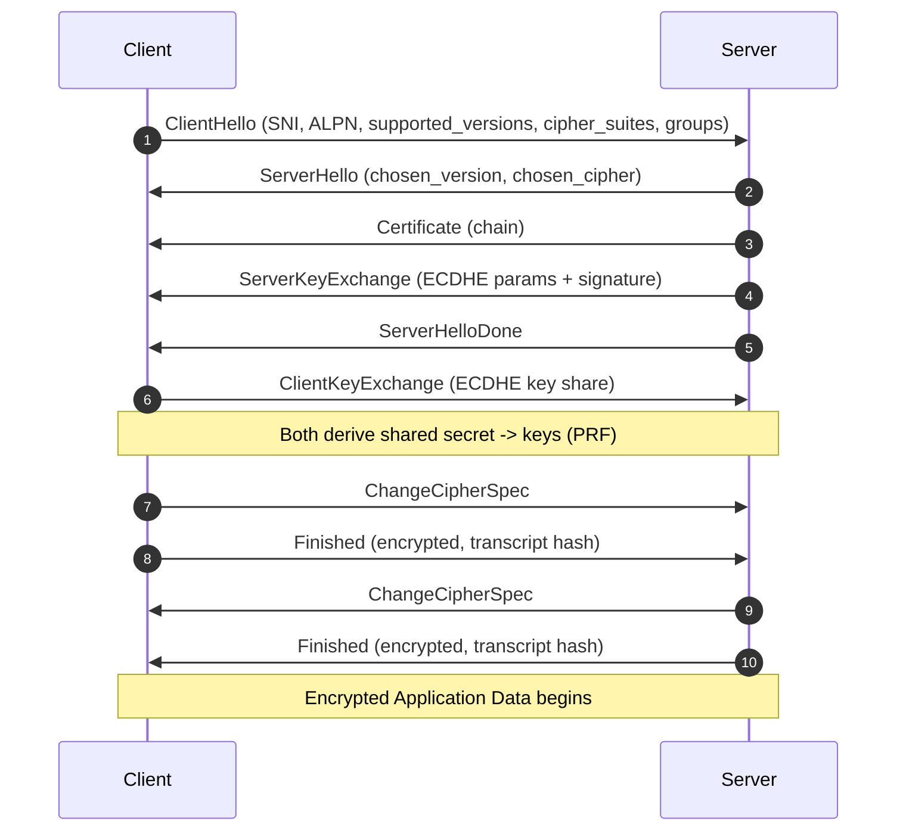
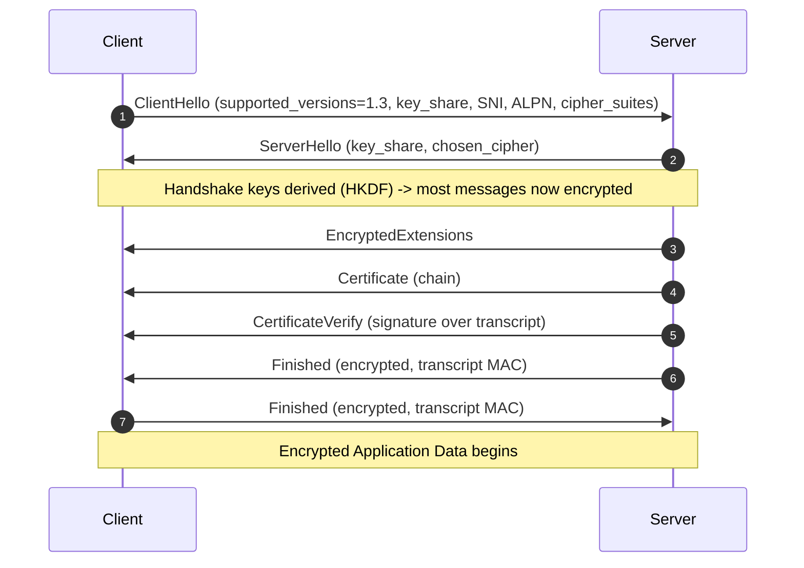
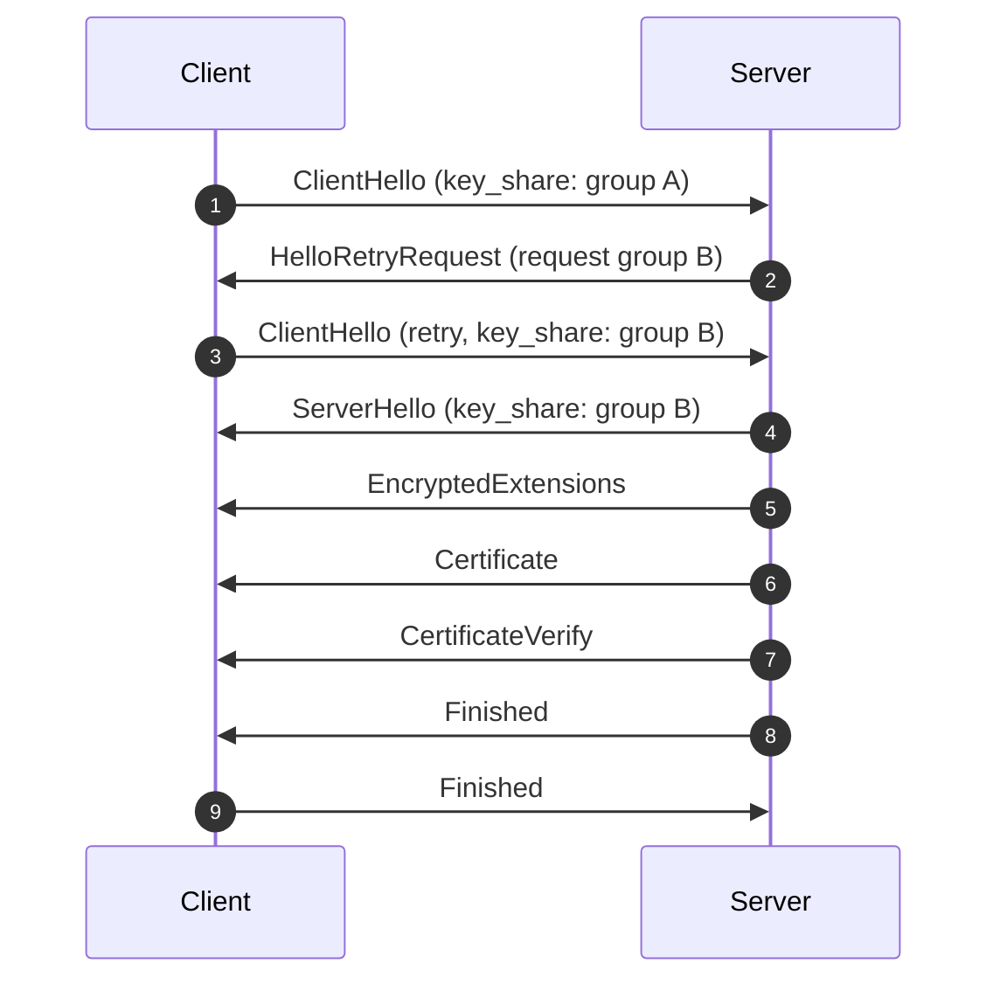
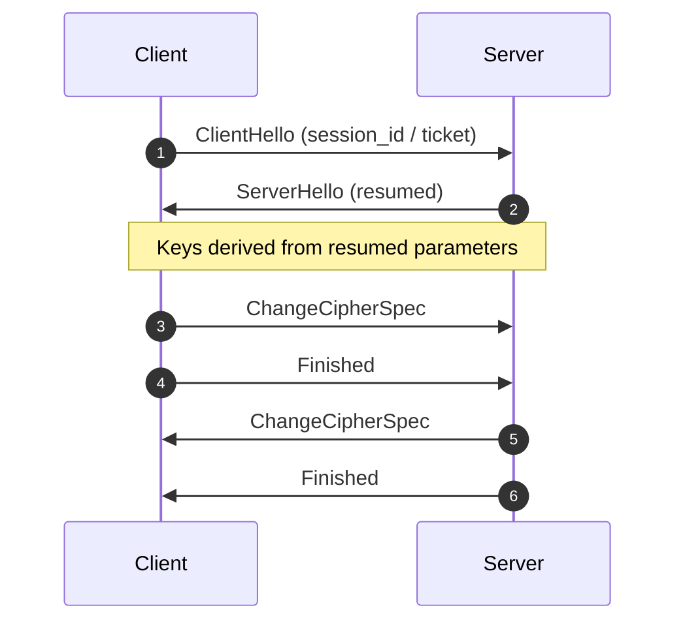
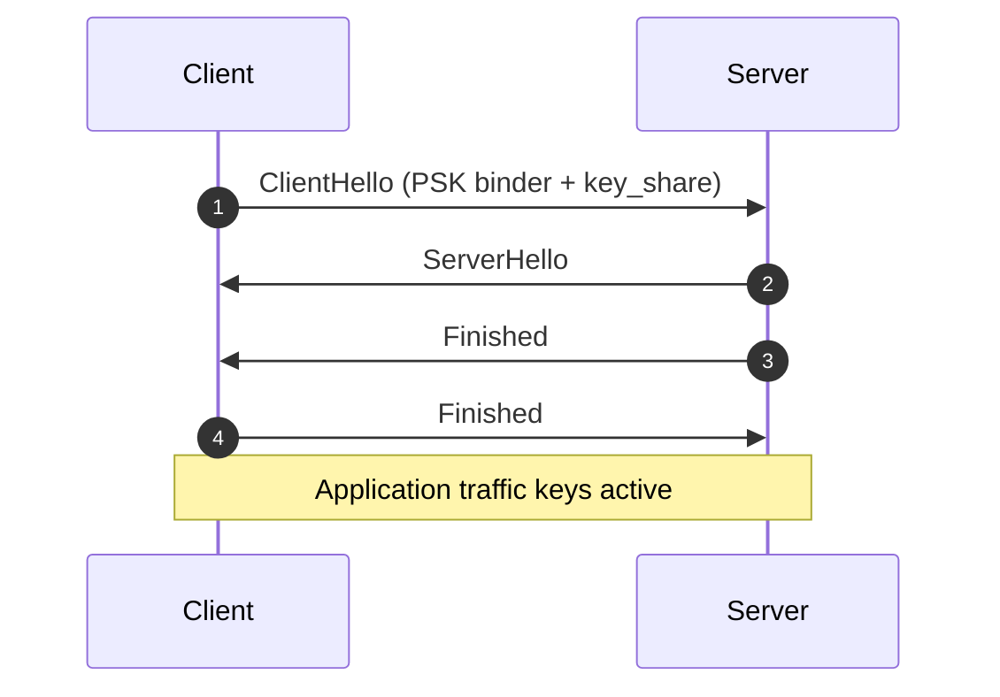
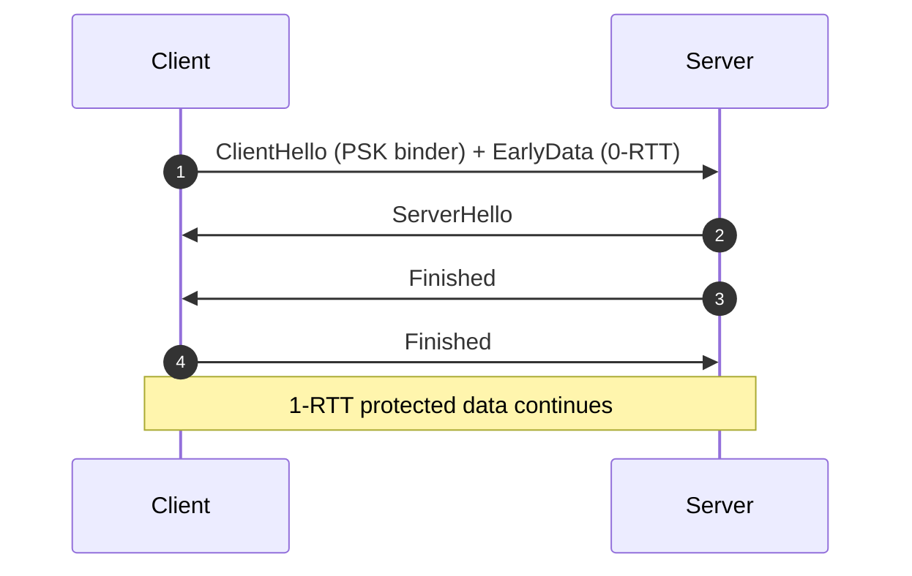

# Certificate Infrastructure Deep Dive — Part 2
## Inside the TLS Handshake

In Part 1, we explored the cryptographic primitives that underpin TLS.
Now we move from theory to protocol.

This article dissects the TLS handshake at a message and architectural level.
We assume familiarity with symmetric crypto, asymmetric keys, and forward secrecy.

---

# 1. Layering: TCP → TLS → Application

TLS operates above TCP.

The sequence:

1. TCP three-way handshake
2. TLS handshake
3. Encrypted application data

TLS is not “encryption of TCP” — it is a protocol layered on top of a reliable byte stream.

---

# 2. Handshake Flow Diagrams

These diagrams show the **typical** handshake flow (happy path). Real-world deployments may add optional messages (OCSP stapling, client auth, HelloRetryRequest, etc.).

## TLS 1.2 (ECDHE) — Typical Full Handshake



Key ideas:
- Cipher suite in TLS 1.2 includes key exchange + auth + bulk cipher + hash.
- The **Finished** messages authenticate the full handshake transcript.

---

## TLS 1.3 — Typical Full Handshake



Key ideas:
- TLS 1.3 makes **(EC)DHE mandatory** and encrypts most handshake content.
- Key schedule is HKDF-chained (Early → Handshake → Master).

---

## TLS 1.3 with HelloRetryRequest (When No Compatible Key Share)

This occurs when the client didn’t offer a key share the server accepts (e.g., server requires a different curve/group).



Operational note:
- HRR costs a round trip. For latency-sensitive systems, ensure clients offer modern groups (x25519 + secp256r1 are common defaults).

---

## Session Resumption (High-Level)

Resumption reduces cost/latency using a PSK established from a prior session.

### TLS 1.2 (Session ID / Ticket) — Simplified View



### TLS 1.3 (PSK Resumption) — Simplified View



---

## 0-RTT Early Data (TLS 1.3) — Conceptual

0-RTT reduces latency but introduces **replay risk**. Only safe for idempotent operations.



---

# 3. ClientHello: Where Negotiation Begins

The ClientHello contains:

- Supported protocol versions
- Random nonce
- Session ID (optional)
- Cipher suites
- Compression methods (deprecated)
- Extensions

Critical extensions:

## SNI (Server Name Indication)

Allows multiple certificates on a single IP address.

Without SNI:
- Server cannot determine which certificate to present.

## ALPN (Application Layer Protocol Negotiation)

Allows negotiation of:
- HTTP/1.1
- HTTP/2
- HTTP/3 (over QUIC)

## Supported Groups

Defines acceptable key exchange groups (e.g., secp256r1, x25519).

---

# 4. Cipher Suite Negotiation

In TLS 1.2, cipher suites combine:

- Key exchange method
- Authentication algorithm
- Bulk encryption cipher
- MAC algorithm

Example:

TLS_ECDHE_RSA_WITH_AES_256_GCM_SHA384

Breakdown:
- ECDHE → Ephemeral key exchange
- RSA → Certificate signature type
- AES_256_GCM → Symmetric cipher
- SHA384 → Hash for handshake

The server selects one suite from the client’s offered list.

Security note:
The server's choice is constrained by both client support and server configuration.

In TLS 1.3, cipher suites are simplified and mostly represent the AEAD + hash, because key exchange/auth are negotiated via extensions.

---

# 5. Certificate Exchange

The server sends:
- Its certificate
- (Optionally) intermediate certificates

Client validation involves:
1. Signature verification
2. Chain building
3. Trust anchor verification
4. Hostname validation (SAN)
5. Expiry check
6. Revocation check (often soft-fail)

Failure at any stage aborts the handshake.

---

# 6. Key Exchange

## TLS 1.2 (ECDHE)

1. Server sends ephemeral public key parameters
2. Client generates its ephemeral key pair
3. Both compute shared secret

Shared secret feeds the PRF to derive:
- Encryption keys
- MAC keys
- IVs

## TLS 1.3

Key exchange happens earlier (ClientHello/ServerHello key shares) and drives the HKDF key schedule.

---

# 7. Finished Messages: Transcript Authentication

The Finished message includes a value derived from the full handshake transcript.
This ensures a MitM cannot alter negotiation parameters undetected.

TLS 1.3 additionally adds `CertificateVerify`, a signature over the transcript proving the server owns the private key for its certificate.

---

# 8. Session Resumption and 0-RTT

Resumption reduces latency and CPU cost, but changes some security properties.

- TLS 1.2: session IDs or session tickets
- TLS 1.3: PSK resumption with binders

0-RTT is opt-in and should be limited to replay-safe operations.

---

# 9. Observing the Handshake

Tools to inspect TLS handshakes:
- Wireshark
- `openssl s_client`
- Browser dev tools
- TLSleuth (PowerShell)

Example:

```powershell
Get-TLSleuthCertificate -Hostname github.com
```

This exposes:
- Negotiated protocol
- Cipher information (runtime-dependent)
- Certificate details
- Timing metrics

---

The handshake is not magic.
It is a deterministic negotiation of cryptographic capability, identity, and trust.
