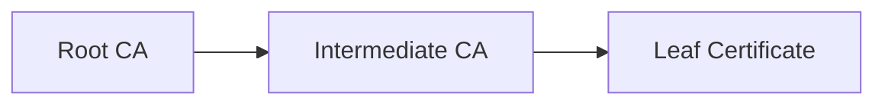
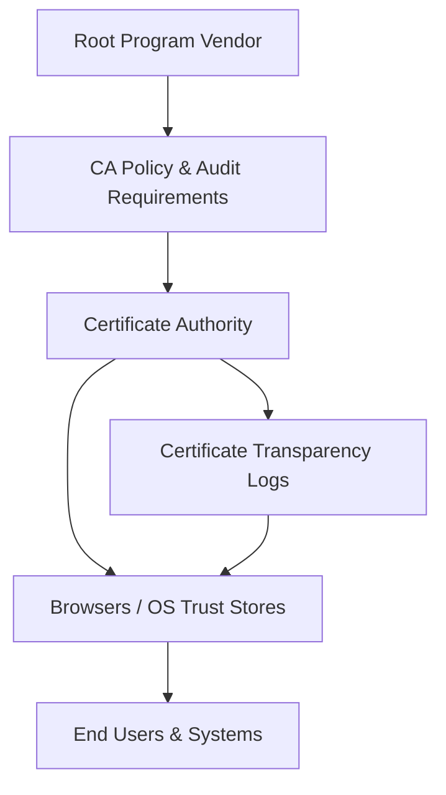

# Certificate Infrastructure Deep Dive — Part 4
## Public Key Infrastructure (PKI) and Trust Stores

In Part 3, we dissected the structure of X.509 certificates.
Now we move up one level — to the system that makes those certificates meaningful.

This article focuses on how trust is established, distributed, and enforced at ecosystem scale.

---

# 1. What PKI Actually Is

Public Key Infrastructure (PKI) is not just certificates.

It is the system responsible for:

- Identity binding
- Certificate issuance
- Revocation
- Trust anchor distribution
- Policy enforcement
- Auditing and governance

At its core, PKI answers a single question:

> Why should I trust this public key?

---

# 2. The Trust Chain Model

Trust is hierarchical.

The client trusts:

- The Root CA (pre-installed trust anchor)
- Which signs Intermediate CAs
- Which sign end-entity certificates

Roots are self-signed.
Trust comes from the trust store — not the signature itself.

---

# 3. Global Root Program Governance

Modern internet trust does not emerge organically — it is governed.

Major platform vendors operate root programs that determine which Certificate Authorities are trusted by default.

### Governance Flow

1. Root program vendor defines technical & audit requirements.
2. Certificate Authorities must comply with baseline requirements (e.g., CA/Browser Forum).
3. Issued certificates must be logged in public CT logs.
4. Browsers and operating systems distribute trusted root stores.
5. End systems inherit trust from those stores.

This is a socio-technical trust model — cryptography alone is insufficient.

---

# 4. Root Certificate Programs

Examples:

- Microsoft Root Program
- Apple Root Program
- Mozilla Root Program
- Android CA Store

Each program:

- Audits CA operators
- Enforces issuance standards
- Requires Certificate Transparency logging
- Maintains incident response processes

Trust is conditional, revocable, and policy-driven.

---

# 5. Why Root CAs Are Offline

In well-designed PKI systems:

- Root CA private key is offline
- Used only to sign intermediate certificates
- Stored in HSM (Hardware Security Module)

Compromise of root CA:

- Catastrophic
- Requires ecosystem-level remediation

Compromise of intermediate CA:

- Severe, but scoped

This separation reduces blast radius.

---

# 6. Cross-Signing

Cross-signing occurs when:

- One CA signs another CA’s certificate
- Multiple trust paths exist to the same key

Used for:

- Backward compatibility
- Root program transitions
- Trust migration

Cross-signing complicates path building and revocation logic.

---

# 7. Trust Stores

A trust store is simply:

- A list of trusted root certificates

Stored in:

- Windows Certificate Store
- macOS Keychain
- Linux CA bundle (/etc/ssl/certs)
- Browser-specific stores

Adding a root to a trust store:

- Grants authority to every certificate that root can sign

This is extremely powerful — and dangerous if misused.

---

# 8. Enterprise PKI Architecture

Internal PKI often follows this model:

Design principles:

- Offline root
- Short-lived intermediates
- Limited key usage
- Strict role-based access control
- Certificate lifecycle monitoring

Enterprise PKI enables:

- Mutual TLS
- Device authentication
- Smart card logon
- SCEP/NDES integrations
- Zero Trust enforcement

---

# 9. Certificate Transparency (CT)

Certificate Transparency is a public log system.

All publicly trusted TLS certificates must be:

- Logged in CT logs
- Verifiable via Signed Certificate Timestamps (SCTs)

Benefits:

- Detect rogue issuance
- Improve ecosystem accountability
- Public auditability

Browsers enforce CT compliance.

---

# 10. Revocation in PKI

Revocation mechanisms:

- CRLs
- OCSP
- OCSP Stapling

Reality:

- Many clients soft-fail
- Revocation checking is inconsistent
- Short-lived certificates reduce dependency on revocation

Operational lesson:

Revocation is slow and reactive.

---

# 11. Trust Failures and Incidents

Historical examples include:

- Compromised intermediate CAs
- Mis-issued certificates
- Rogue CA incidents

When this occurs:

- Root programs remove trust
- Certificates are revoked
- Browsers push emergency updates

PKI is governance enforced by software.

---

# 12. Zero Trust and PKI

Modern security architectures increasingly rely on:

- Certificate-based device identity
- Mutual TLS everywhere
- Strong service-to-service authentication

In Zero Trust environments:

- Identity replaces network perimeter
- Certificates become machine identity tokens

PKI becomes core infrastructure.

---

# 13. What Trust Really Means

A valid TLS handshake means:

- A certificate chain was built
- The root was trusted
- Extensions were valid
- Time window was valid
- No critical policy violations occurred

Trust is the output of layered validation, governance, and operational controls.

---

PKI is not just certificates.
It is a globally distributed trust governance system secured by cryptography.
