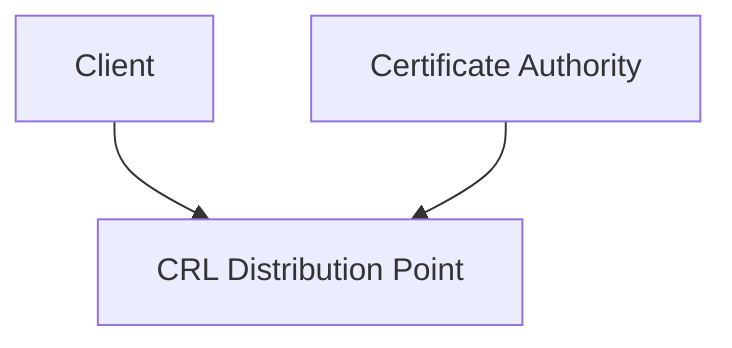
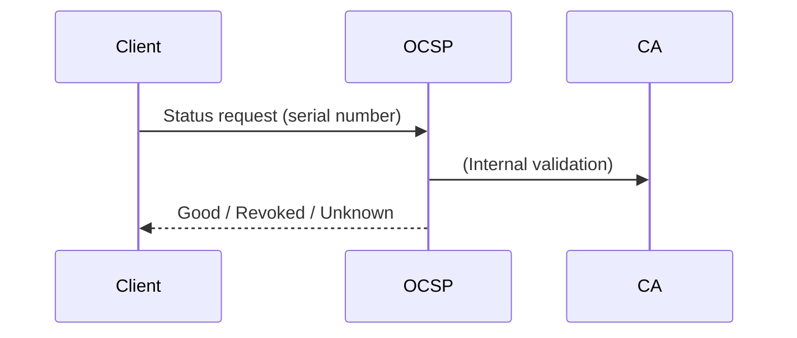
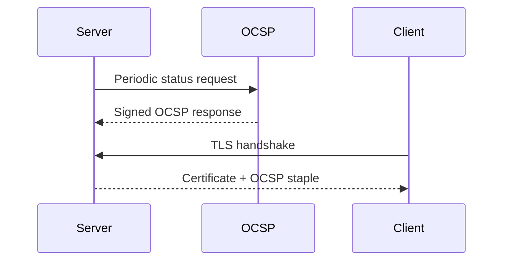

# Certificate Infrastructure Deep Dive — Part 5
## Revocation, OCSP, and Why It Often Fails in Practice

In Part 4, we examined PKI governance and trust stores.

Now we examine one of the weakest — and most misunderstood — parts of the ecosystem:

> Certificate revocation.

Revocation is supposed to answer this question:

**“What if a certificate that was valid yesterday should no longer be trusted today?”**

In theory, revocation solves key compromise and mis-issuance.
In practice, it is slow, inconsistent, and often bypassed.

---

# 1. Why Revocation Exists

Certificates can become untrustworthy before expiry due to:

- Private key compromise
- CA compromise
- Mis-issuance
- Domain control loss
- Policy violations

Revocation provides an early invalidation mechanism.

But revocation operates under severe constraints:

- Internet scale
- Latency sensitivity
- Privacy concerns
- Availability requirements

---

# 2. Certificate Revocation Lists (CRLs)

CRLs are the original revocation mechanism.

A CA periodically publishes:

> A signed list of revoked certificate serial numbers

Clients download and cache this list.

---

## How CRLs Work

Process:

1. Client retrieves CRL from URL in certificate.
2. Verifies CRL signature.
3. Checks if certificate serial number appears in list.

---

## Problems with CRLs

- CRLs grow large (megabytes)
- Download latency impacts handshake
- Clients may cache stale lists
- Revocation delay depends on CRL update frequency

CRLs do not scale well at internet volume.

---

# 3. OCSP — Online Certificate Status Protocol

OCSP was designed to fix CRL inefficiencies.

Instead of downloading a full list, the client asks:

> “Is certificate X still valid?”

---

## OCSP Flow

---

## OCSP Response Types

- good
- revoked
- unknown

Responses are signed by the CA or delegated OCSP responder.

---

# 4. The Soft-Fail Problem

In theory:

If OCSP responder is unreachable → block connection.

In reality:

Most browsers and TLS clients implement **soft-fail**.

If OCSP check fails due to:

- Timeout
- Network error
- Responder unavailable

The connection proceeds anyway.

Why?

Because failing closed would:

- Break large portions of the internet
- Create denial-of-service vectors

This undermines revocation effectiveness.

---

# 5. Privacy Concerns

Traditional OCSP leaks browsing behavior.

Client reveals to CA:

- Which site it is visiting
- When

This creates privacy implications.

Browsers introduced mitigations:

- OCSP stapling
- CRLite (Firefox)
- CRLSets (Chrome)

---

# 6. OCSP Stapling

OCSP stapling shifts responsibility to the server.

Instead of:

Client → OCSP responder

It becomes:

Server → OCSP responder (periodically)
Server → Client (during TLS handshake)

---

## Stapling Flow

Advantages:

- Improves privacy
- Reduces latency
- Avoids client network dependency

Limitations:

- Staple may be stale
- Server misconfiguration common
- Still often soft-fail

---

# 7. Must-Staple

TLS Feature Extension: OCSP Must-Staple.

If present:

- Client must receive valid OCSP staple
- Otherwise handshake fails

In practice:

- Rarely deployed
- Operationally risky
- Increases outage risk if responder unavailable

---

# 8. Why Revocation Often Fails in Practice

## 1. Soft-Fail Behavior

Clients proceed when checks fail.

---

## 2. Performance Constraints

TLS must be fast.
Blocking network calls during handshake is undesirable.

---

## 3. Availability Trade-Off

Revocation systems must never become a single point of failure.

Security engineers often choose:

> Availability over strict revocation enforcement.

---

## 4. Attack Timing Window

Revocation only works after:

- Compromise detected
- CA notified
- Revocation processed
- Clients updated

This introduces delay.

---

# 9. Modern Mitigations

Instead of relying heavily on revocation, modern ecosystems prefer:

### Short-Lived Certificates

- 90-day lifetimes (e.g., Let’s Encrypt)
- Rapid automated renewal

Reduces exposure window.

---

### Certificate Transparency Monitoring

Detects mis-issuance quickly.

---

### Rapid Root Removal

Browsers can remove trust entirely via updates.

---

### CRLite (Firefox)

Uses compressed revocation data for scalable checking.

---

# 10. Enterprise Revocation Realities

In enterprise PKI:

- Revocation often more strictly enforced
- Internal OCSP responders more reliable
- CRL distribution controlled

However:

- Large internal CRLs can still cause performance issues
- Device fleet management becomes critical

---

# 11. The Fundamental Trade-Off

Revocation exists at the intersection of:

- Security
- Availability
- Performance
- Privacy

Strict revocation enforcement increases:

- Latency
- Outage risk
- Operational complexity

Relaxed enforcement increases:

- Exposure window
- Risk during compromise

There is no perfect balance.

---

# 12. The Hard Truth

At internet scale:

Revocation rarely stops real-time attacks.

It is primarily useful for:

- Post-incident containment
- Preventing future exploitation
- Signaling ecosystem distrust

Short-lived certificates and rapid automation are more effective.

---

Revocation is not broken because of cryptography.
It is weakened by scale, latency constraints, and the need to keep the internet available.
