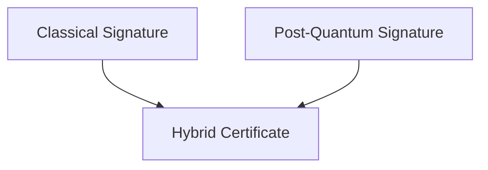

# Certificate Infrastructure Deep Dive — Part 7
## The Future of PKI — Post-Quantum, ACME Evolution, and Decentralized Trust Models

Over the previous six parts, we explored:

- Cryptographic foundations
- TLS handshake mechanics
- X.509 internals
- PKI governance
- Revocation weaknesses
- Real-world failure modes

Now we look forward.

PKI is evolving — driven by:

- Quantum computing risk
- Hyper-scale automation
- Cloud-native architectures
- Zero Trust models
- Machine identity growth

---

# 1. The Post-Quantum Threat Model

Current public-key cryptography relies on problems that are hard for classical computers:

- RSA → Integer factorization
- ECDSA → Elliptic curve discrete logarithm

Quantum computers running **Shor’s Algorithm** could break both efficiently.

If sufficiently powerful quantum machines emerge:

- Public keys could be derived from certificates
- Historical encrypted traffic could be decrypted (harvest now, decrypt later)
- Digital signatures could be forged

---

# 2. Post-Quantum Cryptography (PQC)

Post-quantum cryptography uses algorithms believed resistant to quantum attacks.

Leading candidates (NIST PQC standardization):

- CRYSTALS-Kyber (key encapsulation)
- CRYSTALS-Dilithium (digital signatures)
- Falcon
- SPHINCS+

These are:

- Lattice-based
- Hash-based
- Code-based

---

# 3. Hybrid Certificates

The transition to PQC will not be instantaneous.

Likely evolution:

Hybrid certificates may include:

- Traditional signature (RSA/ECDSA)
- PQC signature
- Dual validation logic

This ensures backward compatibility during transition.

---

# 4. TLS in a Post-Quantum World

TLS 1.3 already supports flexible key exchange groups.

Emerging approaches:

- Hybrid key exchange (ECDHE + Kyber)
- Larger certificate sizes
- Increased handshake overhead

Trade-offs:

- Performance vs security margin
- Bandwidth vs future resilience

Certificate sizes may grow significantly.

---

# 5. ACME at Internet Scale

ACME (Automatic Certificate Management Environment) revolutionized certificate issuance.

It enabled:

- Free certificates
- 90-day lifetimes
- Full automation

But ACME is evolving.

---

## ACME Future Trends

- Shorter lifetimes (30 days?)
- Automatic key rotation
- Certificate Transparency integration by default
- Multi-CA redundancy
- Improved validation resilience

Machine identity issuance is growing exponentially.

---

# 6. Machine Identity Explosion

Modern infrastructure contains:

- Kubernetes workloads
- Service mesh endpoints
- Microservices
- Serverless functions
- IoT devices

Machine certificates now outnumber human identities by orders of magnitude.

This drives:

- Short-lived certificates
- Automated rotation
- SPIFFE-based workload identity

---

# 7. SPIFFE and Workload Identity

SPIFFE (Secure Production Identity Framework For Everyone) defines:

- Standardized workload identities
- URI-based certificate identity (spiffe://)

Used in:

- Service meshes
- Cloud-native environments
- Zero Trust architectures

Identity becomes:

- Workload-scoped
- Cryptographically enforced
- Dynamically issued

---

# 8. Zero Trust and Continuous Authentication

Future PKI trends align with Zero Trust principles:

- No implicit trust based on network location
- Strong cryptographic identity everywhere
- Mutual TLS by default
- Continuous verification

PKI shifts from:

“Website encryption”

To:

“Universal identity infrastructure.”

---

# 9. Decentralized Trust Models

Centralized root programs create systemic risk.

Emerging alternatives include:

- Decentralized Identifiers (DIDs)
- Web of Trust models
- Blockchain-based transparency logs
- Distributed trust anchors

However, challenges include:

- Governance complexity
- Revocation coordination
- Usability barriers

Centralized trust persists because it is operationally simpler.

---

# 10. Certificate Transparency 2.0

Future transparency models may include:

- Real-time monitoring feeds
- Automated domain alerting
- Mandatory proof-of-logging verification
- Enhanced cross-log validation

Transparency becomes proactive rather than reactive.

---

# 11. Hardware-Backed Keys

Future improvements increasingly rely on:

- HSM-backed CA keys
- TPM-based device identity
- Secure enclave workload keys
- Confidential computing environments

Private key compromise remains the highest-impact risk.

Hardware protection reduces attack surface.

---

# 12. Lifecycle Automation as the New Security Boundary

Future PKI security depends less on algorithm strength and more on:

- Automated rotation
- Inventory visibility
- Continuous monitoring
- Policy-as-code enforcement
- Fast incident response

Operational discipline becomes the real security control.

---

# 13. The Strategic Direction of PKI

Future PKI characteristics:

- Short-lived certificates
- Hybrid quantum-safe cryptography
- Full automation
- Mandatory transparency
- Machine-first identity
- Strong governance layering

Trust will become:

- Observable
- Measurable
- Continuously validated

---

# Final Reflection

PKI has evolved from:

- Static server certificates
- Manual renewals
- Multi-year lifetimes

To:

- Automated, short-lived, machine-issued identities
- Globally monitored transparency logs
- Rapid trust updates
- Post-quantum transition planning

The future of PKI is not about eliminating trust hierarchies.

It is about making them:

- Faster
- More observable
- More resilient
- Quantum-resistant

---

# Series Conclusion

Over seven parts, we examined:

1. Cryptographic foundations
2. TLS handshake mechanics
3. X.509 certificate internals
4. Global PKI governance
5. Revocation weaknesses
6. Mis-issuance and attack paths
7. Future evolution

PKI is not perfect.

It is a living system — shaped by cryptography, policy, automation, and adversarial pressure.

And it remains one of the most critical trust systems on the internet.

---

Built for engineers who need to understand not just *how* PKI works —
but *why it works the way it does.*
