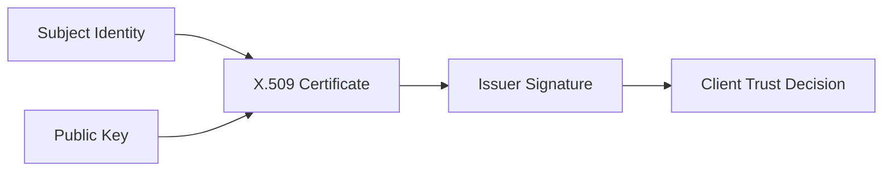
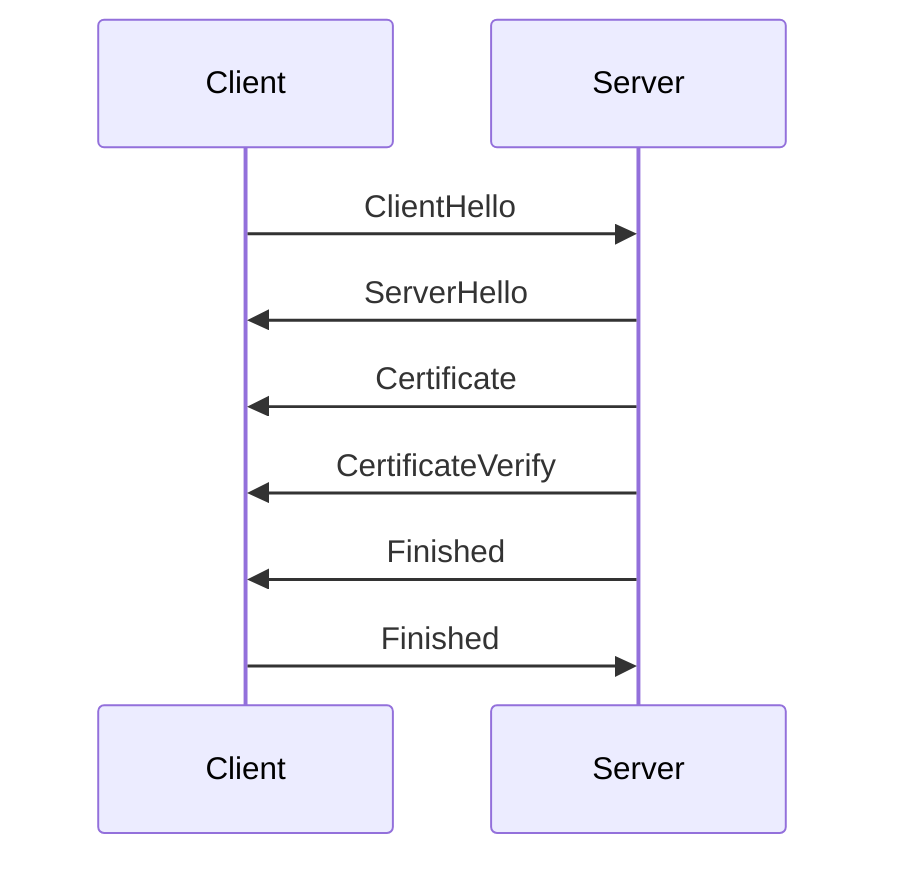

# The Conceptual Model of Certificates

## Overview

At its core, an **X.509 certificate is a cryptographically signed statement that binds an identity to a public key**.

This binding is the foundation of trust for nearly every secure protocol on the internet, including:

- HTTPS
- SMTP with STARTTLS
- IMAPS / POP3S
- VPN authentication
- Code signing
- Software update systems

A TLS client connecting to a server must answer a fundamental question:

> **How do I know this public key actually belongs to the server I intended to connect to?**

Certificates exist to answer that question in a way that can be verified cryptographically and evaluated automatically by software.

---

# Identity + Public Key + Issuer Signature

Conceptually, a certificate is composed of three elements:

```
Identity
+ Public Key
+ Issuer Signature
```

The identity identifies the entity the certificate represents.
The public key is used during cryptographic operations in the TLS handshake.
The issuer signature is the cryptographic proof that a trusted Certificate Authority (CA) vouches for the binding between the two.



The issuer signature is computed over the certificate’s **tbsCertificate** structure (To Be Signed Certificate).

The CA signs the DER‑encoded structure using its private key.

The client verifies the signature using the CA’s public key.

If verification succeeds, the client knows the certificate contents were not modified after issuance.

---

# The Role of Certificate Authorities

Certificate Authorities exist to **attest that a particular identity controls a specific public key**.

In the public web PKI ecosystem, CAs perform several functions:

1. **Identity validation**
2. **Certificate issuance**
3. **Certificate revocation**
4. **Audit and compliance requirements**

For example, when a CA issues a certificate for:

```
example.com
```

the CA performs domain control validation to confirm that the requester actually controls that domain.

Only then does it sign the certificate.

This signature creates a verifiable chain of trust.


---

# The Chain of Trust

A certificate on its own is not enough for a client to trust it.

Instead, certificates are validated through a **chain of trust**.

```
Leaf Certificate
→ Intermediate CA
→ Root CA
```

The leaf certificate is presented by the server during the TLS handshake.

The intermediate certificate signs the leaf certificate.

The root certificate signs the intermediate certificate.


The root certificate must already exist in the client's **trust store**.

If the root is trusted, the entire chain becomes trusted.

This model allows a small number of trusted root keys to authorize a large number of intermediate CAs.

---

# Why the Trust Model Exists

The certificate trust model solves a critical problem:

> **Secure key distribution at internet scale.**

Without certificates, every client would need to know the public key of every server it connects to.

This is not practical.

The PKI hierarchy solves this by allowing clients to trust a small set of root authorities, which can delegate trust to intermediate CAs.

---

# Interaction With the TLS Handshake

Certificates appear in the TLS handshake during the **Certificate** message.

In TLS 1.3 (RFC 8446), the simplified flow looks like this:



The important steps are:

1. The server sends its certificate chain.
2. The client validates the chain.
3. The client verifies the signature using the public key in the certificate.
4. If validation succeeds, the client trusts the server identity.

Only after this process completes does the client allow encrypted application traffic.

---

# What Certificates Do Not Do

A common misconception is that:

> **The certificate encrypts traffic.**

This is incorrect.

Certificates do **not** encrypt application data.

Instead they provide:

- a **verifiable public key**
- a **trusted identity binding**
- authentication for the TLS handshake

Encryption of application traffic happens later using **symmetric session keys** derived during the handshake.

---

# Operational Implications

Understanding the conceptual certificate model is critical when debugging TLS failures.

Common problems include:

- servers presenting incorrect certificates
- missing intermediate certificates
- hostname mismatches
- expired certificates
- untrusted root authorities

These issues manifest as TLS validation failures in clients.

Understanding how certificates establish trust helps engineers quickly diagnose these failures.

---

# Failure Modes

Several historical incidents highlight the fragility of the certificate trust model.

Examples include:

**DigiNotar (2011)**
A Dutch CA was compromised and attackers issued fraudulent certificates for major domains.

**Symantec CA Distrust (2017)**
Google and Mozilla removed trust in Symantec-issued certificates due to improper issuance practices.

These incidents demonstrate that the security of the web PKI depends not only on cryptography, but also on the operational security of certificate authorities.

---

# Summary

X.509 certificates form the **identity layer of TLS**.

They allow a client to determine:

1. The identity of the server
2. The public key associated with that identity
3. Whether that binding is trusted

This trust model allows the internet to scale secure communication across billions of systems while relying on a relatively small set of trusted root authorities.

The next sections will dive deeper into:

- the **ASN.1 structure of certificates**
- **DER encoding**
- **certificate validation algorithms**
- and how TLS libraries actually process certificates in practice.
