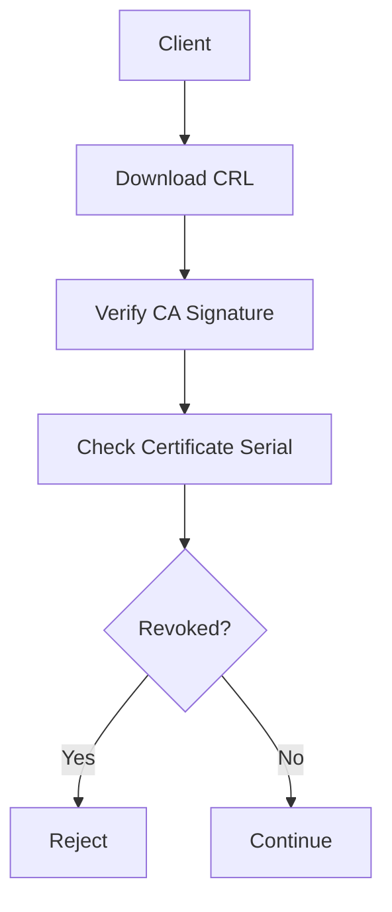
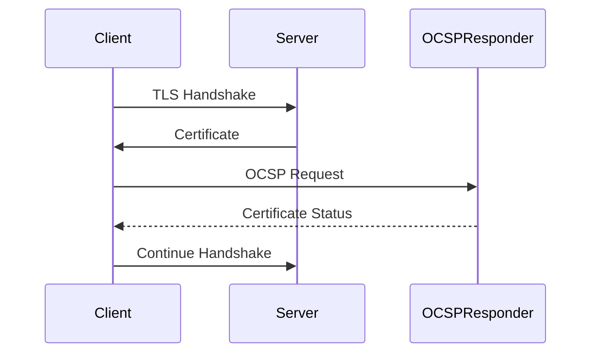
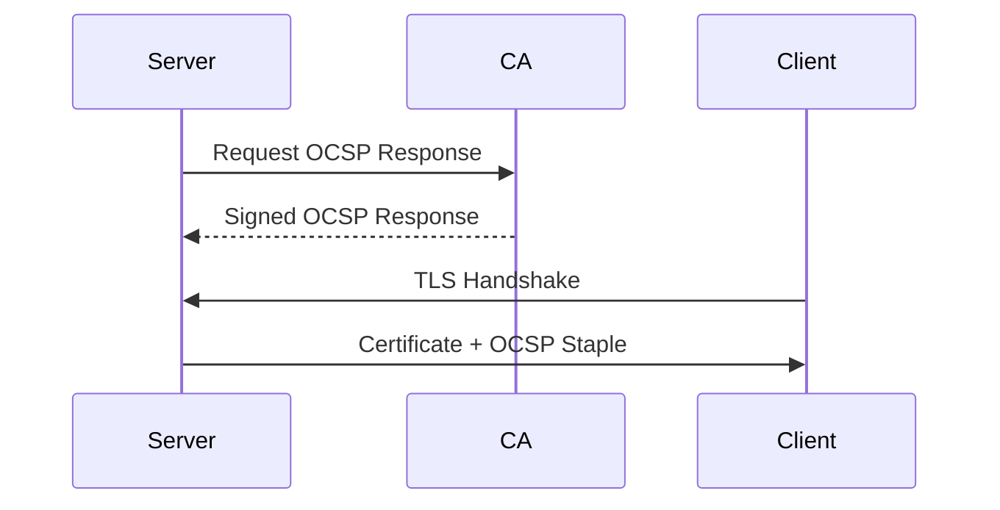

# Revocation Reality

## Overview

The X.509 certificate model assumes that certificates may need to be **revoked before their expiration date**.

Revocation is required when:

- a private key is compromised
- a certificate was mis‑issued
- a certificate subject is no longer authorized
- a certificate authority error occurs

In theory, certificate revocation should allow TLS clients to detect compromised certificates and refuse connections.

In practice, **revocation has historically been unreliable at internet scale**.

This section examines the primary revocation mechanisms used in PKI:

- Certificate Revocation Lists (CRL)
- Online Certificate Status Protocol (OCSP)
- OCSP Stapling

It also explains why revocation frequently fails in practice and why the industry is shifting toward **short‑lived certificates**.

---

# Certificate Revocation Lists (CRL)

## Mechanism

A **Certificate Revocation List** is a periodically published list of revoked certificate serial numbers issued by a Certificate Authority.

The CRL is digitally signed by the CA and can be downloaded by clients.

Example CRL entry:

```
Serial Number: 03:7A:BF:91:AC:21:8C:42
Revocation Date: Feb 12 2026
Reason: Key Compromise
```

Certificates typically include a **CRL Distribution Point** extension:

```
X509v3 CRL Distribution Points:
    URI:http://crl.example-ca.com/root.crl
```

This tells the client where to download the CRL.

---

## CRL Validation Flow



---

## Operational Challenges

CRLs suffer from several major limitations:

| Issue | Description |
|------|-------------|
| Size | CRLs can grow extremely large |
| Bandwidth | Clients must download large lists |
| Latency | Revocation checks delay connections |
| Update Frequency | Revocation may not be visible immediately |

Large CAs may maintain CRLs containing **millions of entries**.

---

# Online Certificate Status Protocol (OCSP)

## Mechanism

OCSP was introduced to solve the scaling limitations of CRLs.

Instead of downloading an entire revocation list, the client queries the CA directly to check the status of a single certificate.

Example request:

```
OCSP Request:
Serial Number: 03:7A:BF:91:AC:21:8C:42
```

Example response:

```
Certificate Status: GOOD
```

Certificates include an OCSP responder URL:

```
Authority Information Access:
    OCSP - URI:http://ocsp.example-ca.com
```

---

## OCSP Validation Flow



---

## OCSP Advantages

Compared to CRLs, OCSP offers:

| Benefit | Explanation |
|--------|-------------|
| smaller responses | only one certificate checked |
| faster validation | no large list downloads |
| near real‑time status | CA can update status quickly |

However, OCSP introduces other problems.

---

# OCSP Privacy Problem

OCSP requests reveal browsing behavior to the CA.

When a client queries the OCSP responder, it effectively tells the CA:

> "This user is connecting to this website."

This creates a privacy issue because the CA becomes aware of the user's browsing activity.

---

# OCSP Availability Problem

OCSP also introduces a reliability dependency.

If the OCSP responder is unavailable, the client must decide whether to:

- reject the connection
- allow the connection anyway

Most clients choose to **allow the connection**, which leads to a major weakness.

---

# Soft-Fail Behavior

Most TLS clients implement **soft-fail revocation checking**.

Soft-fail means:

| OCSP Result | Client Behavior |
|-------------|----------------|
| certificate good | allow connection |
| certificate revoked | reject connection |
| OCSP server unreachable | allow connection |

This behavior exists because blocking connections whenever OCSP servers fail would break large portions of the internet.

However, it also means attackers can bypass revocation by blocking OCSP traffic.

---

# OCSP Stapling

OCSP Stapling was introduced to reduce OCSP privacy and reliability problems.

With OCSP Stapling, the **server retrieves the OCSP response from the CA and sends it during the TLS handshake**.

This avoids requiring the client to contact the CA directly.

---

## OCSP Stapling Flow



The client verifies the stapled OCSP response using the CA's signature.

---

# Limitations of OCSP Stapling

OCSP Stapling improves performance and privacy, but it still has limitations.

| Issue | Description |
|------|-------------|
| server configuration required | many servers do not enable stapling |
| caching requirements | servers must periodically refresh responses |
| incomplete support | some TLS implementations ignore stapled responses |

Because of these limitations, OCSP Stapling is helpful but not a complete solution.

---

# Why Revocation Fails at Internet Scale

Despite decades of development, revocation mechanisms remain unreliable.

Major challenges include:

| Problem | Explanation |
|--------|-------------|
| network dependency | revocation checks require external servers |
| latency | additional network requests slow TLS connections |
| privacy concerns | OCSP reveals browsing behavior |
| soft-fail logic | clients often ignore revocation failures |

These problems mean that **revocation frequently fails to protect users from compromised certificates**.

---

# Shift Toward Short-Lived Certificates

Because revocation mechanisms are unreliable, the PKI ecosystem has increasingly moved toward **short‑lived certificates**.

Instead of relying on revocation, certificates simply **expire quickly**.

Examples:

| CA | Typical Lifetime |
|----|-----------------|
| Let's Encrypt | 90 days |
| Modern commercial CAs | ~1 year |
| Proposed future limits | < 90 days |

Short-lived certificates reduce risk because:

- compromised certificates expire quickly
- revocation becomes less critical
- automated renewal systems replace manual revocation processes

---

# Automation and ACME

The rise of **ACME (Automatic Certificate Management Environment)** has made short-lived certificates practical.

ACME allows servers to automatically:

- request certificates
- renew certificates
- install certificates

Example ACME clients:

- Certbot
- Caddy
- Traefik
- Kubernetes cert-manager

Automation enables certificates to be rotated frequently without manual intervention.

---

# Summary

Revocation was originally intended to provide a mechanism for invalidating compromised certificates before expiration.

However, real-world constraints such as:

- latency
- privacy concerns
- infrastructure reliability
- soft-fail behavior

have made revocation difficult to enforce consistently.

As a result, the modern PKI ecosystem increasingly relies on **short-lived certificates and automated renewal** rather than traditional revocation mechanisms.

Understanding the limitations of revocation is essential for engineers designing secure TLS infrastructure.
