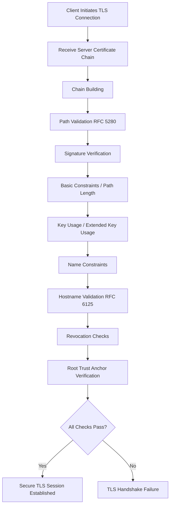

# The TLS Trust Pipeline (Conclusion)

## Overview

Across the previous sections we dissected the internal mechanics of the TLS trust system:

1. Cryptographic primitives
2. Key exchange and forward secrecy
3. Certificate structure and encoding
4. Subject Public Key Info
5. Certificate extensions
6. Chain construction
7. RFC 5280 path validation
8. Hostname validation
9. Trust stores and root governance
10. Revocation systems

Individually these components appear manageable.

Together they form one of the most complex trust systems deployed globally — the **Web Public Key Infrastructure (Web PKI)**.

This final section summarizes how these pieces interact during a real TLS connection and explains how tools such as **TLSleuth** can help engineers investigate and troubleshoot TLS behavior in production systems.

---

# The Complete TLS Trust Pipeline

When a client connects to a TLS service, a sequence of validation steps occurs.
These steps combine cryptographic verification with policy enforcement.



Each step contributes a different dimension of trust.

| Step | Purpose |
|-----|---------|
| Chain building | locate intermediate certificates |
| Path validation | enforce PKI rules |
| Hostname validation | verify service identity |
| Revocation checks | detect compromised certificates |
| Trust anchor check | ensure root CA is trusted |

A failure at **any stage** terminates the TLS handshake.

---

# Why TLS Failures Are Hard to Diagnose

TLS validation errors are often difficult to diagnose because failures may occur in different parts of the pipeline.

Example failure categories:

| Category | Example Problem |
|--------|----------------|
| Chain construction | missing intermediate |
| Path validation | incorrect BasicConstraints |
| Identity validation | SAN mismatch |
| Revocation | OCSP failure |
| Trust anchor | root not trusted |

Many TLS debugging tools expose only **partial information**, making it difficult to determine which stage failed.

This is where dedicated diagnostic tooling becomes valuable.

---

# Investigating TLS with TLSleuth

Tools such as **TLSleuth** help engineers extract useful information directly from a TLS connection.

Example usage:

```powershell
Get-TLSleuthCertificate -Hostname github.com
```

Example output:

```
NegotiatedProtocol      : TLS 1.3
CipherAlgorithm         : AES
CipherStrength          : 128
NegotiatedCipherSuite   : TLS_AES_128_GCM_SHA256
```

This output allows engineers to quickly determine:

- TLS protocol version
- negotiated cipher suite
- encryption strength
- certificate details

TLSleuth effectively surfaces key details from the **TLS handshake and SslStream state**, enabling rapid inspection of remote endpoints.

---

# Mapping TLSleuth Output to the TLS Trust Pipeline

TLSleuth can expose information corresponding to several validation stages.

| TLS Stage | Relevant TLSleuth Output |
|----------|--------------------------|
| TLS negotiation | NegotiatedProtocol |
| Cipher suite selection | NegotiatedCipherSuite |
| Encryption algorithm | CipherAlgorithm |
| Key strength | CipherStrength |
| Certificate chain | server certificate fields |

This mapping allows engineers to correlate TLSleuth output with the underlying TLS validation logic discussed in earlier sections.

---

# Real‑World Troubleshooting Scenarios

TLS debugging frequently involves identifying failures in the trust pipeline.

Examples include:

### Expired Certificate

Symptoms:

- TLS handshake fails
- browser error `CERT_DATE_INVALID`

Diagnosis:

- examine certificate validity period
- confirm renewal automation

---

### Missing Intermediate

Symptoms:

- works in some clients but not others

Diagnosis:

- inspect certificate chain
- verify intermediate certificates are sent by server

---

### Hostname Mismatch

Symptoms:

```
NET::ERR_CERT_COMMON_NAME_INVALID
```

Diagnosis:

- verify SAN entries match requested hostname

---

### Unsupported Cipher Suite

Symptoms:

- handshake failure during negotiation

Diagnosis:

- inspect negotiated cipher suite
- verify client/server compatibility

---

# TLSleuth Roadmap

TLSleuth already provides useful TLS handshake information, but it could evolve into a more comprehensive TLS diagnostic platform.

Potential future capabilities include:

---

## Certificate Chain Analysis

TLSleuth could display the full certificate chain and highlight issues such as:

- missing intermediates
- incorrect BasicConstraints
- weak signature algorithms

---

## Hostname Validation Testing

Allow engineers to test hostname matching rules against SAN entries.

Example:

```
Test-TLSleuthHostnameMatch -Hostname api.example.com -Certificate cert.pem
```

---

## Revocation Inspection

TLSleuth could query:

- CRL distribution points
- OCSP responders

and display revocation status directly.

---

# The Bigger Picture

The TLS trust system is an intricate combination of:

- cryptography
- distributed trust governance
- certificate lifecycle management
- protocol negotiation
- identity verification

Despite its complexity, this system successfully secures **billions of connections per day across the internet**.

Understanding the underlying mechanics allows engineers to:

- diagnose TLS failures
- design secure infrastructure
- evaluate PKI risks
- build better security tools

Tools like **TLSleuth** provide visibility into this system, helping engineers bridge the gap between protocol theory and real-world operational behavior.

---

# Final Thoughts

TLS certificates are often treated as opaque configuration artifacts.

In reality they represent a sophisticated trust architecture built on decades of cryptographic research and operational experience.

By understanding:

- how certificates are structured
- how chains are constructed
- how validation algorithms operate
- how trust stores govern root authorities

engineers gain the ability to reason about TLS systems with far greater precision.

The goal of this series is to turn TLS from a **black box** into an **understandable system**.

Once the mechanics are clear, debugging TLS becomes far less mysterious.
