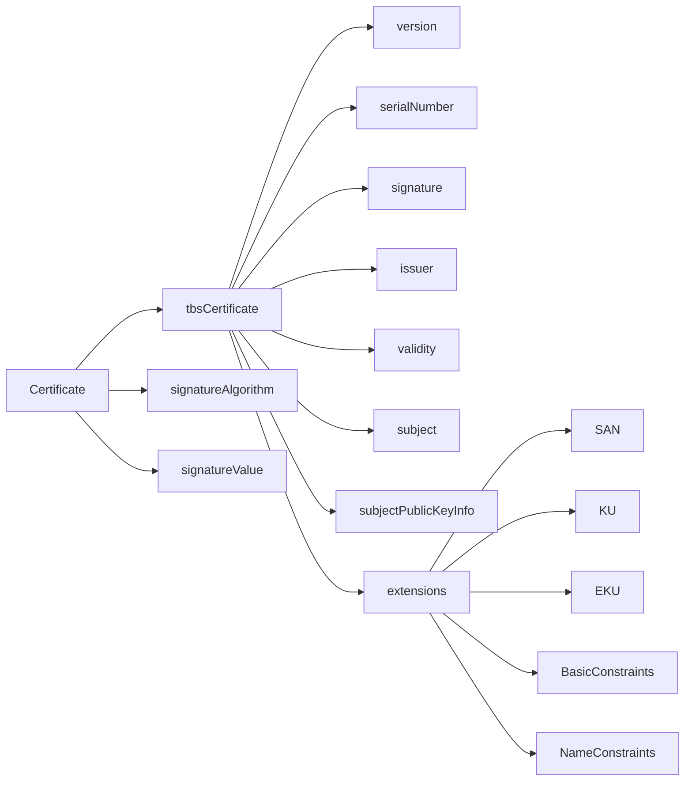
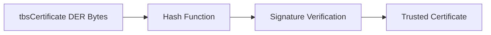

# ASN.1 and DER Encoding

## Overview

X.509 certificates are defined using **ASN.1 (Abstract Syntax Notation One)** and encoded using **DER (Distinguished Encoding Rules)**.

ASN.1 defines the **logical structure** of the data.
DER defines the **exact binary encoding** used to serialize that structure so it can be transmitted and signed.

Understanding ASN.1 and DER is critical because the **digital signature on a certificate is calculated over the DER-encoded data**.
Any change to the binary encoding — even if the logical structure remains identical — will cause the signature verification to fail.

This deterministic encoding requirement is what allows TLS clients to verify that the certificate contents have not been modified after issuance.

---

# ASN.1 — Abstract Syntax Notation One

ASN.1 is a language used to define structured data formats in a platform‑independent way.

It describes the **schema** of the certificate but does not specify how the data is encoded in binary.

The X.509 certificate structure defined in **RFC 5280** looks conceptually like this:



The key component is **tbsCertificate**, which stands for:

> **To Be Signed Certificate**

The certificate authority signs the DER encoding of this structure.

---

# DER — Distinguished Encoding Rules

DER is a **binary encoding standard** derived from BER (Basic Encoding Rules).

Its defining property is that **each ASN.1 structure has exactly one valid binary representation**.

This property is essential for digital signatures.

If multiple encodings existed for the same logical structure, signature verification would become ambiguous.

DER achieves deterministic encoding through strict rules such as:

- definite length encoding
- canonical ordering
- minimal integer encoding

---

# TLV Encoding Model

DER uses a **Tag‑Length‑Value (TLV)** encoding format.

Every field is encoded as three components:

```
Tag | Length | Value
```

Example:

| Component | Description |
|----------|-------------|
| Tag | Identifies the ASN.1 type |
| Length | Specifies the number of bytes in the value |
| Value | The encoded data |

Example binary representation:

```
30 82 03 5A
```

Where:

```
30 = SEQUENCE tag
82 = length encoding indicator
035A = length value
```

---

# Common ASN.1 Types in Certificates

Several ASN.1 primitive types appear frequently in certificates.

| ASN.1 Type | Purpose |
|------------|---------|
| SEQUENCE | Ordered collection of elements |
| INTEGER | Serial numbers, version numbers |
| OBJECT IDENTIFIER | Identifies algorithms |
| BIT STRING | Stores public keys |
| OCTET STRING | Stores extension data |
| UTCTime / GeneralizedTime | Validity timestamps |

Example of an algorithm identifier:

```
1.2.840.113549.1.1.11
```

This Object Identifier represents:

```
sha256WithRSAEncryption
```

---

# Inspecting DER Encoding with OpenSSL

Engineers can inspect the raw ASN.1 structure of a certificate using:

```bash
openssl asn1parse -in cert.pem
```

Example output:

```
0:d=0  hl=4 l=1187 cons: SEQUENCE
4:d=1  hl=4 l= 907 cons: SEQUENCE
8:d=2  hl=2 l=   3 cons: cont [ 0 ]
```

Interpretation:

| Field | Meaning |
|------|--------|
| d | ASN.1 nesting depth |
| hl | header length |
| l | value length |
| cons | constructed ASN.1 type |

This output allows engineers to see the **exact ASN.1 structure used in the certificate**.

---

# Why Deterministic Encoding Matters

The certificate signature is calculated over the **DER‑encoded bytes of the tbsCertificate structure**.

Verification works as follows:

1. The client extracts the **tbsCertificate bytes**
2. The client computes the hash of those bytes
3. The client verifies the signature using the issuer’s public key



If even a single byte of the DER encoding changes, the hash changes and the signature verification fails.

---

# Implementation Reality

Different TLS stacks rely on ASN.1 parsers to decode certificates.

| TLS Library | ASN.1 Implementation |
|-------------|----------------------|
| OpenSSL | libcrypto ASN.1 parser |
| BoringSSL | custom minimal ASN.1 parser |
| NSS (Firefox) | SEC_ASN1 |
| Windows CryptoAPI | proprietary ASN.1 decoding |

ASN.1 parsing bugs have historically been a source of vulnerabilities due to the complexity of BER/DER encoding rules.

---

# Operational Implications

For most engineers, ASN.1 and DER remain invisible during normal TLS operation.

However they become important when diagnosing:

- certificate parsing failures
- malformed certificates
- signature verification errors
- compatibility issues between TLS libraries

Tools such as **openssl asn1parse** allow engineers to inspect the exact encoding and diagnose structural problems.

---

# Failure Modes

Incorrect DER encoding can lead to:

- certificate rejection by TLS libraries
- signature verification failure
- interoperability problems between implementations

Historically, ASN.1 parsing errors have also caused **memory corruption vulnerabilities in TLS libraries**, making ASN.1 parsing a critical attack surface.

---

# Summary

ASN.1 defines the **logical structure of certificates**, while DER defines the **canonical binary encoding used for digital signatures**.

Together they ensure that certificate data can be:

- structured consistently
- transmitted reliably
- verified cryptographically

Understanding this encoding layer provides the foundation for the next section, where we examine the **individual certificate fields in detail** and how TLS clients interpret them during validation.
