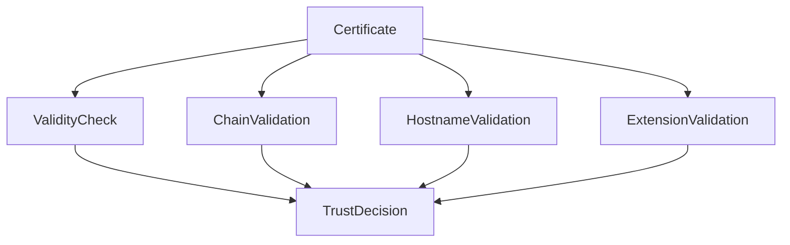

# Certificate Field Deep Dive

## Overview

An X.509 certificate is a structured ASN.1 object defined by **RFC 5280**.
While the high-level purpose of a certificate is to bind an **identity to a public key**, the internal structure contains numerous fields that influence how TLS clients validate the certificate.

In this section we will perform a **line-by-line analysis of a real certificate**, examining:

- what each field means
- how TLS clients use it during validation
- operational implications for engineers running production infrastructure

The example below is produced using:

```bash
openssl x509 -in cert.pem -text -noout
```

---

# Example Certificate

Below is a simplified example similar to what might be returned for a typical web server certificate.

```
Certificate:
    Data:
        Version: 3 (0x2)
        Serial Number:
            03:7a:bf:91:ac:21:8c:42
        Signature Algorithm: sha256WithRSAEncryption
        Issuer: C=US, O=Example CA, CN=Example Intermediate CA
        Validity
            Not Before: Feb  1 00:00:00 2026 GMT
            Not After : May  1 23:59:59 2026 GMT
        Subject: CN=example.com
        Subject Public Key Info:
            Public Key Algorithm: rsaEncryption
                RSA Public-Key: (2048 bit)
        X509v3 extensions:
            X509v3 Subject Alternative Name:
                DNS:example.com, DNS:www.example.com
            X509v3 Key Usage: critical
                Digital Signature, Key Encipherment
            X509v3 Extended Key Usage:
                TLS Web Server Authentication
            X509v3 Basic Constraints:
                CA:FALSE
```

---

# Version

```
Version: 3 (0x2)
```

## Mechanism

X.509 certificates exist in three versions:

| Version | Purpose |
|-------|--------|
| v1 | Basic certificate fields only |
| v2 | Added issuer and subject identifiers |
| v3 | Introduced extensions |

Modern TLS certificates are **always version 3**, because extensions such as SAN and KeyUsage are mandatory.

## Specification Reference

Defined in **RFC 5280 Section 4.1.2.1**.

## Operational Implications

Without version 3, a certificate cannot contain extensions, making it incompatible with modern TLS validation requirements.

---

# Serial Number

```
Serial Number:
    03:7a:bf:91:ac:21:8c:42
```

## Mechanism

The serial number uniquely identifies a certificate issued by a CA.

It is used for:

- certificate revocation
- auditing
- tracking issuance records

## Specification Reference

Defined in **RFC 5280 Section 4.1.2.2**.

## Security Considerations

Modern CA/B Forum requirements mandate that serial numbers be **cryptographically random and unpredictable**.

This prevents attacks where attackers attempt to create certificates with colliding serial numbers.

## Operational Implications

Serial numbers appear in:

- **CRL entries**
- **OCSP responses**
- security incident investigations

---

# Signature Algorithm

```
Signature Algorithm: sha256WithRSAEncryption
```

## Mechanism

This field indicates the algorithm the issuing CA used to sign the certificate.

Common values include:

| Algorithm | Description |
|----------|-------------|
| sha256WithRSAEncryption | RSA with SHA‑256 |
| ecdsa-with-SHA256 | ECDSA signature |
| sha384WithRSAEncryption | RSA with SHA‑384 |

## Important Clarification

This algorithm **does not determine how TLS encrypts traffic**.

It only defines how the **certificate itself is signed by the CA**.

## Historical Context

Older certificates used **SHA‑1**, but browsers deprecated SHA‑1 signatures due to collision attacks.

---

# Issuer

```
Issuer: C=US, O=Example CA, CN=Example Intermediate CA
```

## Mechanism

The issuer field identifies the certificate authority that signed the certificate.

It is represented as a **Distinguished Name (DN)** composed of attributes such as:

- Country (C)
- Organization (O)
- Common Name (CN)

## Protocol Mechanics

During chain validation, the client searches for a certificate whose **Subject matches this Issuer field**.

This allows the TLS client to construct the certificate chain.

## Operational Implications

If the intermediate certificate is missing from the server configuration, clients may fail to build the chain.

This is one of the most common TLS misconfigurations.

---

# Validity Period

```
Validity
    Not Before: Feb  1 00:00:00 2026 GMT
    Not After : May  1 23:59:59 2026 GMT
```

## Mechanism

The validity window defines when the certificate is considered trustworthy.

## Specification Reference

Defined in **RFC 5280 Section 4.1.2.5**.

TLS clients must verify that the current system time falls within this range.

## Operational Implications

Common failure scenarios include:

- expired certificates
- clock skew between systems
- improperly configured renewal automation

Modern browsers limit certificate lifetimes to **398 days**.

Many organizations now deploy **90‑day certificates** with automated renewal.

---

# Subject

```
Subject: CN=example.com
```

## Mechanism

Historically the Subject field contained the identity of the certificate holder.

However modern TLS clients **do not rely on the CN field for hostname validation**.

Instead they use the **Subject Alternative Name extension**.

## Specification Reference

CN fallback behavior is deprecated in **RFC 6125**.

## Operational Implications

Certificates relying only on CN may fail in modern clients.

---

# Subject Public Key Info (SPKI)

```
Subject Public Key Info:
    Public Key Algorithm: rsaEncryption
        RSA Public-Key: (2048 bit)
```

## Mechanism

SPKI contains the server's public key and the algorithm identifier.

Structure:

```
SubjectPublicKeyInfo
 ├─ Algorithm Identifier
 └─ Public Key
```

## Protocol Mechanics

During the TLS handshake the server proves possession of the private key corresponding to this public key.

This occurs during the **CertificateVerify** step in TLS 1.3.

## Operational Implications

Key size and algorithm affect performance.

| Algorithm | Typical Key Size |
|----------|-----------------|
| RSA | 2048–4096 |
| ECDSA | 256–384 |

ECDSA certificates are generally smaller and faster.

---

# Extensions

Extensions define how a certificate can be used and what identities it represents.

---

## Subject Alternative Name

```
DNS:example.com, DNS:www.example.com
```

SAN lists the identities for which the certificate is valid.

Modern TLS clients perform hostname validation against this list.

If the hostname does not appear in SAN, validation fails.

---

## Key Usage

```
Digital Signature, Key Encipherment
```

KeyUsage restricts which cryptographic operations the key may perform.

Examples include:

- digitalSignature
- keyEncipherment
- keyCertSign

TLS servers typically require **Digital Signature**.

---

## Extended Key Usage

```
TLS Web Server Authentication
```

Extended Key Usage restricts the application contexts in which the certificate may be used.

Common values:

| EKU | Purpose |
|-----|--------|
| serverAuth | TLS server authentication |
| clientAuth | TLS client authentication |

If a certificate includes EKU but does not contain serverAuth, browsers will reject it.

---

## Basic Constraints

```
CA:FALSE
```

This extension determines whether the certificate can act as a CA.

| Value | Meaning |
|------|---------|
| CA:TRUE | certificate can sign other certificates |
| CA:FALSE | end-entity certificate |

---

# How TLS Clients Use These Fields

During certificate validation a TLS client evaluates multiple fields simultaneously.



All checks must succeed before the certificate is trusted.

---

# Operational Failure Modes

Common certificate-related outages include:

| Issue | Cause |
|------|------|
| Expired certificate | failed renewal automation |
| Hostname mismatch | incorrect SAN configuration |
| Missing intermediate | server misconfiguration |
| EKU mismatch | incorrect certificate type |

Understanding certificate fields helps engineers diagnose these failures quickly.

---

# Summary

Although certificates appear simple, each field participates in the complex validation logic defined in **RFC 5280** and implemented in TLS libraries.

Understanding how these fields interact is essential for:

- debugging TLS handshake failures
- operating certificate infrastructure
- designing reliable automated certificate management systems
