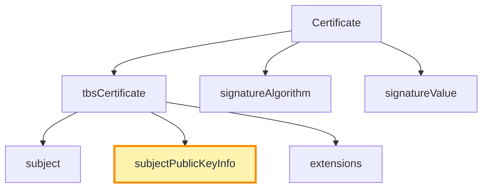
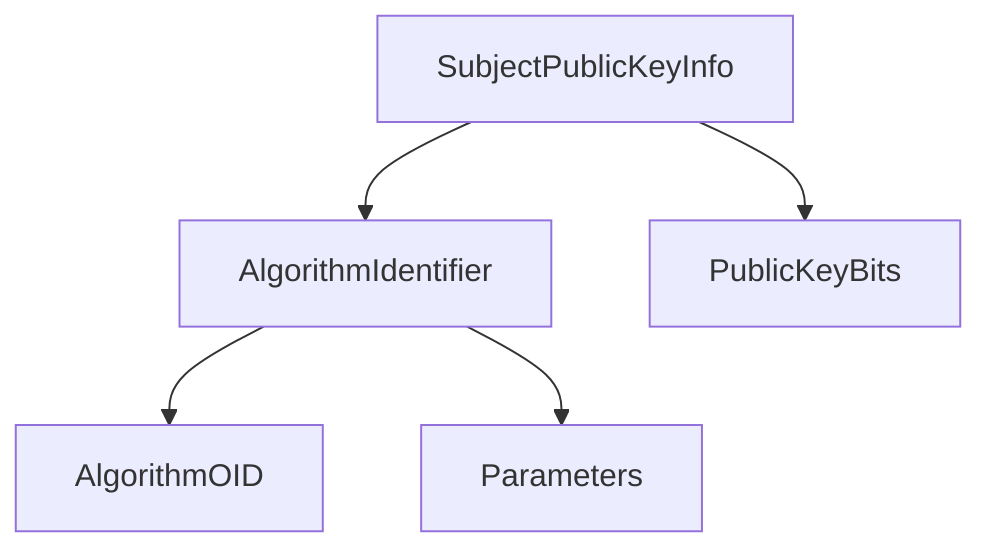
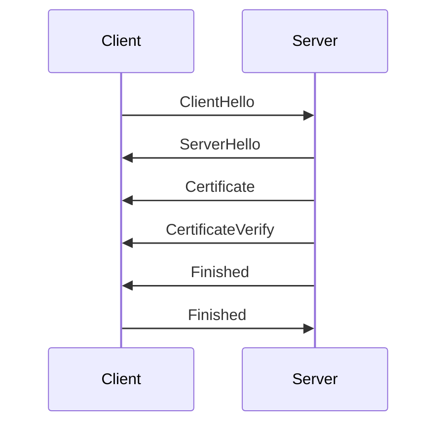

# Subject Public Key Info (SPKI) Deep Dive

## Overview

Within an X.509 certificate, the **Subject Public Key Info (SPKI)** field is arguably the most important component.
While many fields provide metadata about identity, trust, and usage constraints, the SPKI section contains the **actual cryptographic key material** that enables TLS authentication.

During a TLS handshake, the client ultimately trusts the certificate **because it trusts the public key contained in SPKI**.

The certificate itself does not encrypt traffic. Instead it provides a **verifiable mechanism for distributing the server’s public key**, which is then used during the TLS handshake to authenticate the server and establish secure session keys.

---

# Where SPKI Appears in the Certificate Structure

In ASN.1 terms, SPKI is part of the **tbsCertificate** structure defined in RFC 5280.



The **Certificate Authority signs the entire tbsCertificate structure**, which includes SPKI.

This means the public key itself is protected by the CA’s digital signature.

If an attacker modifies the public key, the certificate signature verification will fail.

---

# ASN.1 Structure of SPKI

The SPKI field is defined in ASN.1 as:

```
SubjectPublicKeyInfo ::= SEQUENCE {
    algorithm            AlgorithmIdentifier,
    subjectPublicKey     BIT STRING
}
```

This structure contains two elements:

| Field | Purpose |
|------|---------|
| AlgorithmIdentifier | Specifies the key algorithm (RSA, ECDSA, etc.) |
| subjectPublicKey | Encoded public key bits |

The **AlgorithmIdentifier** itself is another ASN.1 structure:

```
AlgorithmIdentifier ::= SEQUENCE {
    algorithm   OBJECT IDENTIFIER,
    parameters  ANY OPTIONAL
}
```

This identifies the cryptographic algorithm used by the key.

Example OIDs:

| Algorithm | OID |
|-----------|--------------------------|
| rsaEncryption | 1.2.840.113549.1.1.1 |
| id-ecPublicKey | 1.2.840.10045.2.1 |

---

# Visualizing the SPKI Structure



The **BIT STRING** contains the raw public key data encoded according to the specified algorithm.

---

# RSA Public Key Encoding

For RSA certificates, the subjectPublicKey field contains an ASN.1 structure called **RSAPublicKey**.

```
RSAPublicKey ::= SEQUENCE {
    modulus           INTEGER,
    publicExponent    INTEGER
}
```

Example:

```
RSA Public-Key: (2048 bit)
Modulus:
    00:af:23:...
Exponent: 65537
```

Components:

| Field | Meaning |
|------|---------|
| modulus | Large integer representing the RSA modulus |
| publicExponent | Exponent used during RSA operations |

The exponent is typically **65537**, which provides efficient modular exponentiation while maintaining strong security properties.

---

# ECDSA Public Key Encoding

For elliptic curve certificates, the key is encoded differently.

Instead of modulus/exponent pairs, the key is represented as a **point on an elliptic curve**.

The algorithm identifier specifies the curve being used.

Example:

```
id-ecPublicKey
prime256v1
```

The BIT STRING then contains the **elliptic curve point coordinates**.

Structure:

```
ECPoint ::= OCTET STRING
```

The first byte indicates whether the point is compressed or uncompressed.

Example:

```
04 <X coordinate> <Y coordinate>
```

Where:

| Byte | Meaning |
|-----|---------|
| 04 | uncompressed point indicator |
| X | x coordinate |
| Y | y coordinate |

---

# Inspecting SPKI with OpenSSL

Engineers can extract the SPKI information using:

```bash
openssl x509 -in cert.pem -text -noout
```

Example output:

```
Subject Public Key Info:
    Public Key Algorithm: rsaEncryption
        RSA Public-Key: (2048 bit)
```

To extract the public key itself:

```bash
openssl x509 -pubkey -noout -in cert.pem
```

This command outputs the public key in **PEM format**.

---

# How TLS Uses the Public Key

During a TLS handshake, the public key contained in SPKI is used for **server authentication**.

In TLS 1.3 the sequence looks like this:



The key steps are:

1. The server sends its certificate chain.
2. The client extracts the public key from SPKI.
3. The server signs handshake data using its private key.
4. The client verifies the signature using the public key.

If verification succeeds, the client knows the server **possesses the private key corresponding to the certificate**.

---

# RSA vs ECDSA Certificates

Modern PKI ecosystems increasingly favor **elliptic curve keys** over RSA.

Comparison:

| Property | RSA | ECDSA |
|--------|-----|------|
| Typical Key Size | 2048–4096 bits | 256–384 bits |
| Certificate Size | Larger | Smaller |
| TLS Handshake Speed | Slower | Faster |
| CPU Cost | Higher | Lower |

Because elliptic curve keys are smaller, they reduce:

- certificate size
- handshake latency
- CPU overhead

This is why many large platforms now prefer **ECDSA certificates**.

---

# Operational Implications

SPKI choices affect real-world infrastructure performance.

Large-scale platforms evaluate:

- handshake latency
- CPU cost of signature verification
- certificate size affecting TLS packet fragmentation

For example, using ECDSA certificates can significantly reduce TLS handshake overhead at high traffic volumes.

---

# Failure Modes

Misconfiguration of SPKI-related parameters can cause TLS failures.

Examples include:

| Failure | Cause |
|-------|------|
| Unsupported algorithm | client does not support key type |
| Weak key length | certificate rejected by client |
| Corrupted key encoding | ASN.1 parsing error |

Modern browsers enforce minimum key sizes such as **2048-bit RSA**.

---

# Summary

The **Subject Public Key Info field is the cryptographic core of the certificate**.

It contains the public key that enables:

- server authentication
- handshake signature verification
- secure session establishment

The surrounding certificate structure provides **trust metadata**, but the SPKI field is ultimately the element that allows a TLS client to verify the server’s identity cryptographically.

Understanding how SPKI is encoded and used during the TLS handshake is essential for engineers designing and operating secure TLS infrastructure.
