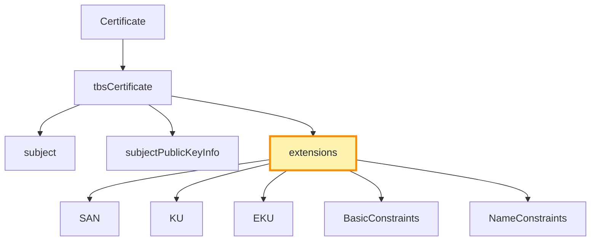
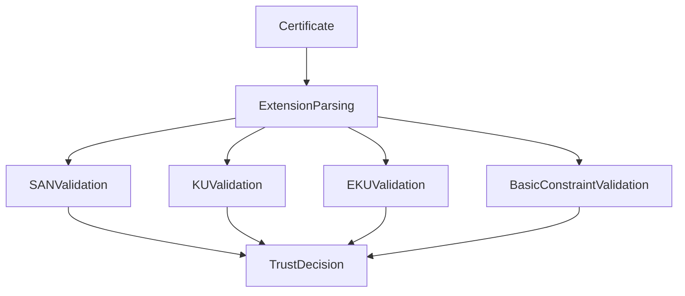

# Certificate Extensions Deep Dive

## Overview

X.509 version 3 introduced **certificate extensions**, which dramatically expanded the expressive power of certificates.

Earlier certificate versions could only bind:

- an identity
- to a public key
- signed by a certificate authority

But they could not express **how that key was allowed to be used**, **what identities it represented**, or **whether the certificate could issue other certificates**.

Extensions solve these limitations.

Modern TLS validation relies heavily on several critical extensions:

- Subject Alternative Name (SAN)
- Key Usage (KU)
- Extended Key Usage (EKU)
- Basic Constraints
- Name Constraints

These extensions directly influence how TLS clients interpret and validate certificates.

Most TLS failures in production environments are caused by **incorrect extension configuration**, not cryptographic errors.

---

# Where Extensions Appear in the Certificate

Extensions are part of the **tbsCertificate** structure defined in RFC 5280.



Extensions are encoded as:

```
Extensions ::= SEQUENCE OF Extension

Extension ::= SEQUENCE {
    extnID      OBJECT IDENTIFIER,
    critical    BOOLEAN DEFAULT FALSE,
    extnValue   OCTET STRING
}
```

Each extension contains:

| Field | Meaning |
|------|--------|
| extnID | OID identifying the extension |
| critical | whether the extension must be understood |
| extnValue | encoded extension data |

If a **critical extension is not understood**, TLS clients must reject the certificate.

---

# Subject Alternative Name (SAN)

## Purpose

The **Subject Alternative Name** extension defines the identities that the certificate is valid for.

Example:

```
X509v3 Subject Alternative Name:
    DNS:example.com
    DNS:www.example.com
```

SAN can contain multiple identity types:

| Type | Example |
|-----|--------|
| DNS | example.com |
| IP | 192.168.1.1 |
| URI | spiffe://service |
| Email | admin@example.com |

---

## Why SAN Exists

Historically, the **Common Name (CN)** field inside the Subject was used for hostname validation.

This approach had limitations:

- only one identity
- ambiguous semantics
- not structured for multiple identities

SAN replaced CN because it supports **multiple identities and explicit identity types**.

Modern TLS stacks perform hostname validation **only against SAN**.

---

## Operational Implications

A certificate must contain the hostname requested by the client.

If the hostname does not appear in SAN, TLS validation fails.

Common failure scenario:

| Problem | Result |
|-------|-------|
| SAN missing hostname | browser certificate error |
| wrong wildcard usage | validation failure |

---

# Key Usage (KU)

## Purpose

Key Usage defines the **cryptographic operations allowed for the key**.

Example:

```
X509v3 Key Usage: critical
    Digital Signature, Key Encipherment
```

This extension is represented as a **bit string**.

| Bit | Meaning |
|----|--------|
| digitalSignature | key can sign data |
| keyEncipherment | encrypt keys |
| keyCertSign | sign certificates |
| cRLSign | sign CRLs |

---

## TLS Implications

For TLS server certificates, the key must support:

- **digitalSignature** (for TLS 1.3)

Earlier TLS versions sometimes required **keyEncipherment** for RSA key exchange.

---

## Failure Modes

Certificates lacking required Key Usage bits may be rejected by TLS clients.

Example misconfiguration:

| Missing Usage | Result |
|---------------|-------|
| digitalSignature | TLS handshake failure |

---

# Extended Key Usage (EKU)

## Purpose

Extended Key Usage further restricts **the application contexts in which the certificate may be used**.

Example:

```
X509v3 Extended Key Usage:
    TLS Web Server Authentication
```

Common EKU values:

| OID | Purpose |
|----|--------|
| serverAuth | TLS server authentication |
| clientAuth | TLS client authentication |
| codeSigning | software signing |
| emailProtection | S/MIME |

---

## TLS Behavior

If EKU exists, the certificate must include **serverAuth** to be accepted by browsers.

If EKU is absent, behavior varies between implementations.

Most modern CAs include EKU explicitly.

---

## Operational Failure Modes

Certificates issued for the wrong purpose can cause TLS failures.

Example:

| Certificate Type | Failure |
|----------------|--------|
| clientAuth only | server authentication rejected |

---

# Basic Constraints

## Purpose

Basic Constraints defines whether a certificate can act as a **Certificate Authority**.

Example:

```
X509v3 Basic Constraints:
    CA:FALSE
```

Possible values:

| Value | Meaning |
|------|--------|
| CA:TRUE | certificate can sign other certificates |
| CA:FALSE | end-entity certificate |

---

## Path Length Constraints

CA certificates may include:

```
pathLenConstraint
```

This limits how many subordinate CAs can exist beneath it.

Example:

| Path Length | Meaning |
|-------------|--------|
| 0 | may issue only end-entity certs |
| 1 | may issue one level of intermediate CA |

---

## TLS Validation Impact

If a certificate attempts to issue another certificate without **CA:TRUE**, validation fails.

---

# Name Constraints

## Purpose

Name Constraints restrict what identities subordinate CAs may issue certificates for.

Example:

```
permittedSubtrees:
    DNS:example.com
```

This means subordinate certificates must match **example.com**.

---

## Structure

Name Constraints contain:

- permittedSubtrees
- excludedSubtrees

Example rules:

| Rule | Effect |
|-----|-------|
| permittedSubtrees | allowed identities |
| excludedSubtrees | forbidden identities |

---

## Real-World Use

Name Constraints are primarily used by:

- enterprise PKI systems
- government trust hierarchies
- large internal PKI deployments

Public Web PKI rarely uses them due to compatibility issues.

---

# How TLS Clients Process Extensions

During certificate validation, clients evaluate extensions as part of the path validation algorithm.



All required extension checks must pass before the certificate is accepted.

---

# Operational Reality

Extension misconfiguration is responsible for a large percentage of TLS failures.

Typical causes include:

| Issue | Cause |
|------|------|
| missing SAN | legacy certificate generation |
| incorrect EKU | wrong certificate template |
| missing BasicConstraints | improper CA configuration |

Understanding extensions is therefore essential for engineers diagnosing certificate problems.

---

# Summary

Certificate extensions define the **rules governing how certificates are interpreted and trusted**.

They specify:

- what identities the certificate represents
- how the key may be used
- whether the certificate can issue others
- what identities subordinate certificates may contain

Without extensions, modern PKI would not be able to enforce the constraints required to secure the global TLS ecosystem.
