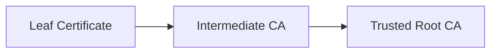
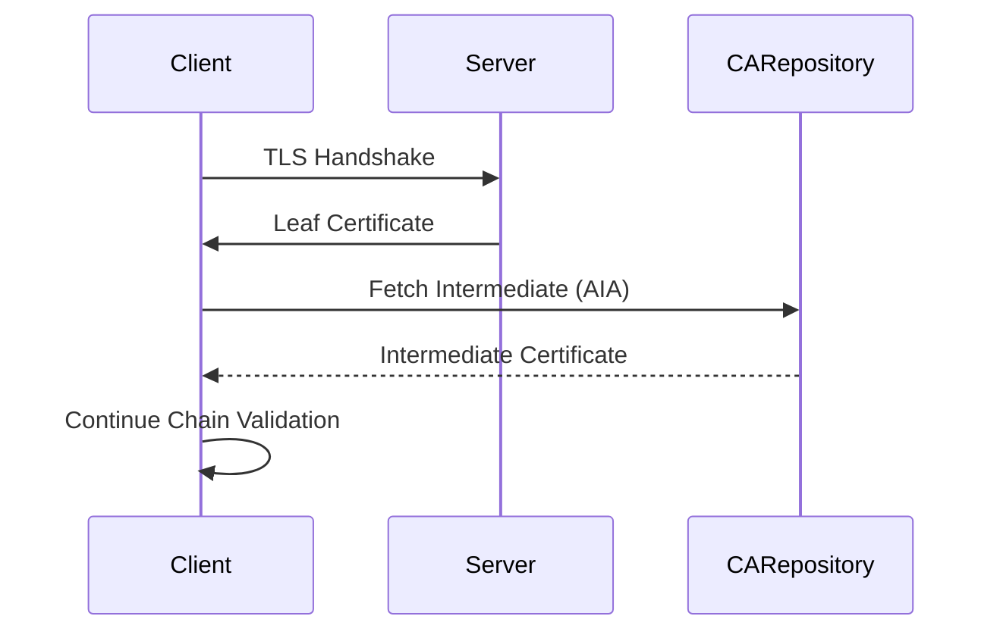
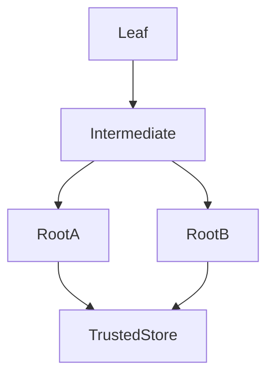
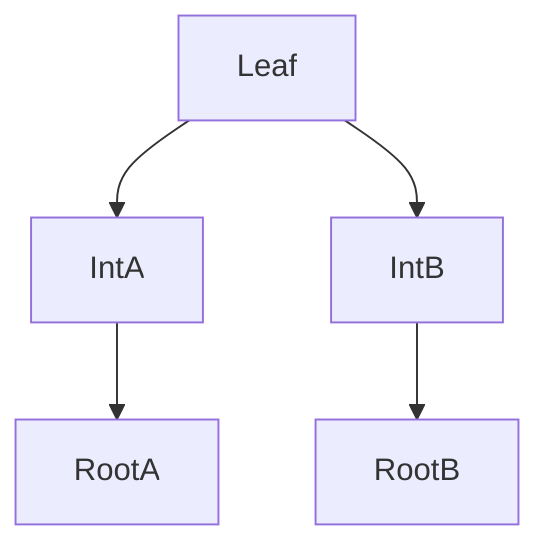

# Certificate Chain Building Algorithms

## Overview

When a TLS client receives a certificate from a server, it rarely receives a **complete trust chain** that directly terminates at a trusted root.

Instead, the server typically sends:

- the **leaf certificate**
- one or more **intermediate certificates**

The TLS client must then **construct a valid certification path** from the leaf certificate to a trusted root in its local trust store.

This process is called **certificate chain building** (or path construction).

Chain building is not trivial. Multiple potential chains may exist, intermediates may be missing, and roots may be **cross‑signed**.

Different TLS implementations use different algorithms and heuristics to build chains, which can lead to subtle interoperability issues.

---

# Basic Chain Structure

The simplest trust chain looks like this:



The validation engine must confirm:

1. Each certificate is **signed by the next certificate in the chain**
2. The chain terminates at a **trusted root**
3. All **extensions and policies** are valid

However, real-world PKI introduces additional complexity.

---

# Authority Information Access (AIA) Fetching

Servers sometimes omit intermediate certificates when presenting the TLS chain.

To handle this, many TLS clients use **Authority Information Access (AIA)** to retrieve missing intermediates.

Example extension:

```
Authority Information Access:
    CA Issuers - URI:http://example.com/intermediate.crt
```

The validation engine may attempt to download this certificate if it is not locally available.



### Operational Implications

AIA fetching introduces several issues:

| Issue | Description |
|------|-------------|
| Network dependency | Validation may require external HTTP requests |
| Performance impact | Certificate validation becomes slower |
| Security considerations | External fetches introduce attack surface |

Because of this, many environments disable AIA fetching.

Servers should ideally **always send the complete certificate chain**.

---

# Cross-Signed Certificates

Root certificates are sometimes **cross-signed** by another CA.

This creates multiple potential trust paths.

Example:



This structure allows the same intermediate CA to chain to multiple root authorities.

Cross-signing has historically been used to:

- transition between root programs
- maintain compatibility with legacy systems
- extend trust for older clients

A well-known example was the **Let's Encrypt cross-sign from DST Root CA X3**.

---

# Alternate Trust Paths

When cross-signing exists, multiple valid paths may be possible.

Example:



The validation engine must determine **which chain to build**.

Selection criteria often include:

- whether the root exists in the trust store
- certificate expiration
- policy constraints

Different TLS libraries may choose different chains.

---

# Chain Building Algorithm (Simplified)

The chain building process generally follows these steps:

1. Start with the **leaf certificate**
2. Search for candidate **issuer certificates**
3. Verify signature relationships
4. Repeat until reaching a **trusted root**
5. Validate extensions and constraints

Simplified pseudocode:

```
function build_chain(leaf):
    candidates = [leaf]

    while candidates not empty:
        cert = candidates.pop()

        if cert in trusted_roots:
            return valid_chain

        issuers = find_possible_issuers(cert)

        for issuer in issuers:
            if verify_signature(cert, issuer):
                candidates.append(issuer)

    return validation_failure
```

Real implementations include additional checks such as:

- policy validation
- path length constraints
- name constraints

---

# Implementation Differences

TLS libraries implement chain building differently.

These differences explain why a certificate may work in one environment but fail in another.

## OpenSSL

OpenSSL typically relies on:

- certificates sent by the server
- intermediates provided in local certificate stores

Historically OpenSSL **does not automatically perform AIA fetching**.

This means missing intermediates often cause validation failures.

---

## Windows CryptoAPI

Windows implements a much more aggressive chain building strategy.

Features include:

- AIA fetching
- automatic intermediate caching
- alternate chain exploration

This allows Windows to successfully validate chains that fail in OpenSSL.

However it also introduces additional network behavior.

---

## NSS (Firefox)

Mozilla's **NSS library** performs strict path validation aligned with Mozilla's root program policies.

NSS performs:

- intermediate caching
- strict extension enforcement
- certificate transparency checks

Firefox may reject chains accepted by other clients if they violate Mozilla PKI policies.

---

# Real-World Failure Scenarios

Chain building issues commonly cause TLS outages.

Typical examples:

| Problem | Cause |
|--------|------|
| Missing intermediate | server misconfiguration |
| Incorrect chain order | improperly configured TLS server |
| expired cross-sign | legacy compatibility chain |
| different root trust stores | client platform differences |

A common diagnostic tool is:

```
openssl s_client -connect example.com:443 -showcerts
```

This command reveals the certificates presented by the server.

---

# Operational Best Practices

To ensure reliable certificate validation:

- Always configure servers to **send the full certificate chain**
- Avoid relying on **AIA fetching**
- Monitor certificate expiration across all chain elements
- Test certificates against **multiple TLS libraries**

Large-scale operators frequently test chains using:

- OpenSSL
- Windows
- Firefox/NSS
- Android trust stores

This ensures compatibility across diverse clients.

---

# Summary

Certificate chain building is a complex process that goes far beyond simple signature verification.

Modern TLS clients must account for:

- missing intermediates
- cross-signed roots
- alternate trust paths
- implementation differences between TLS stacks

Understanding how chain construction works is essential for diagnosing certificate validation failures in production systems.

The next section examines the **formal path validation algorithm defined in RFC 5280**, which governs how each certificate in the constructed chain is evaluated.
