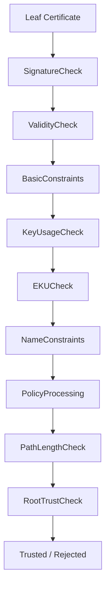
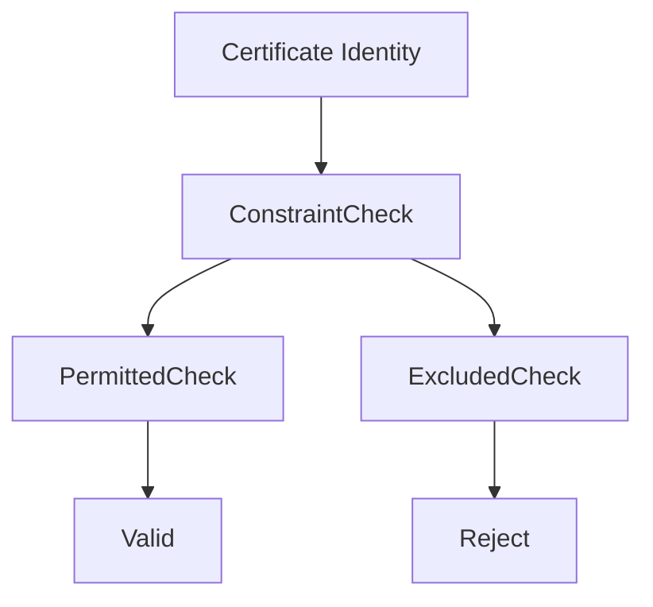
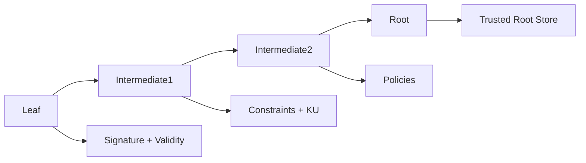

# RFC 5280 Path Validation Algorithm

## Overview

Once a TLS client has **constructed a candidate certificate chain**, it must determine whether that chain is trustworthy.

This process is defined formally in **RFC 5280 Section 6 — Certification Path Validation**.

Path validation is not simply:

- checking signatures
- checking expiration dates

Instead it is a **stateful validation algorithm** that evaluates:

- certificate signatures
- validity periods
- basic constraints
- key usage
- extended key usage
- name constraints
- certificate policies
- path length constraints
- revocation status

Every certificate in the chain is processed sequentially from **leaf → root**.

If **any step fails**, the entire chain is rejected.

---

# Validation Pipeline Overview

The certificate validation pipeline can be visualized as:



Each certificate contributes information that influences validation state for the remainder of the chain.

---

# Inputs to the Validation Algorithm

RFC 5280 defines several inputs required for path validation.

| Input | Description |
|------|-------------|
| certification path | ordered list of certificates |
| trust anchor | trusted root certificate |
| validation time | timestamp used for validity checks |
| initial policy set | allowed certificate policies |
| name constraints | permitted identities |
| revocation information | CRL or OCSP data |

The trust anchor is typically a **root certificate in the operating system or browser trust store**.

---

# High-Level Validation Steps

RFC 5280 Section 6 defines the validation process as a sequence of steps applied to each certificate.

Simplified version:

1. Initialize validation state
2. Process each certificate in the path
3. Verify signatures
4. Check certificate validity period
5. Process BasicConstraints and path length
6. Evaluate KeyUsage
7. Process NameConstraints
8. Evaluate certificate policies
9. Confirm root trust anchor

If all checks succeed, the certificate chain is trusted.

---

# Validation State Machine

Internally, validation engines maintain **state variables** while processing the chain.

Example state variables include:

| Variable | Purpose |
|--------|---------|
| max_path_length | limits subordinate CA depth |
| permitted_subtrees | allowed name ranges |
| excluded_subtrees | forbidden name ranges |
| valid_policies | acceptable certificate policies |
| working_public_key | key used to verify next certificate |

These values evolve as the chain is processed.

---

# Simplified Path Validation Pseudocode

The following pseudocode illustrates the core path validation logic.

```
function validate_path(cert_chain, trust_anchor):

    working_key = trust_anchor.public_key
    max_path_length = infinity

    for cert in cert_chain:

        # 1. Verify certificate signature
        if not verify_signature(cert, working_key):
            return validation_failure

        # 2. Check validity period
        if current_time not in cert.validity:
            return validation_failure

        # 3. Process basic constraints
        if cert.is_ca:
            max_path_length -= 1
        else:
            if cert != leaf_certificate:
                return validation_failure

        if max_path_length < 0:
            return validation_failure

        # 4. Process key usage
        if not allowed_key_usage(cert):
            return validation_failure

        # 5. Process name constraints
        if not check_name_constraints(cert):
            return validation_failure

        # 6. Update working key
        working_key = cert.public_key

    return validation_success
```

Real implementations include additional checks such as:

- certificate policy intersection
- revocation processing
- critical extension handling

---

# Basic Constraints Evaluation

The **BasicConstraints extension** determines whether a certificate may act as a CA.

Example:

```
X509v3 Basic Constraints:
    CA:TRUE
```

Rules:

| Condition | Result |
|----------|--------|
| CA:FALSE used as issuer | validation failure |
| pathLenConstraint exceeded | validation failure |

Path length constraints prevent overly deep certificate hierarchies.

---

# Key Usage Evaluation

KeyUsage defines what operations a certificate's key may perform.

Example:

```
Key Usage: critical
    Digital Signature
    Key Cert Sign
```

Evaluation rules include:

| Usage | Requirement |
|------|-------------|
| digitalSignature | required for TLS authentication |
| keyCertSign | required for CA certificates |
| cRLSign | required for CRL issuers |

If a certificate violates these restrictions, validation fails.

---

# Extended Key Usage (EKU) Evaluation

EKU limits **application-level usage** of a certificate.

Example:

```
Extended Key Usage:
    TLS Web Server Authentication
```

TLS clients verify that the certificate includes **serverAuth** when used for HTTPS.

Example OIDs:

| EKU | OID |
|----|----|
| serverAuth | 1.3.6.1.5.5.7.3.1 |
| clientAuth | 1.3.6.1.5.5.7.3.2 |

If EKU exists and the required usage is missing, the certificate is rejected.

---

# Name Constraints Evaluation

NameConstraints restrict identities that subordinate CAs may issue.

Example:

```
permittedSubtrees:
    DNS:example.com
```

Evaluation process:



If a certificate identity falls outside permitted ranges or inside excluded ranges, validation fails.

---

# Certificate Policy Processing

Certificate policies allow organizations to enforce policy constraints across a chain.

Policies are represented by **OID identifiers**.

Example:

```
Certificate Policies:
    Policy: 2.23.140.1.2.1
```

During validation:

1. Policies from each certificate are intersected.
2. Invalid policy paths are eliminated.
3. If no valid policy path remains, validation fails.

This mechanism enables organizations to enforce rules such as:

- EV certificates
- government PKI policies
- enterprise trust requirements

---

# Root Trust Anchor Verification

The final certificate in the chain must match a **trusted root certificate**.

This root is not validated by another certificate.

Instead it is trusted because it exists in the **local trust store**.

Example trust stores:

| Platform | Root Store |
|---------|-----------|
| Windows | CryptoAPI Root Store |
| macOS | Keychain |
| Linux | system CA bundle |
| Firefox | NSS root store |

If the chain terminates at an untrusted root, validation fails.

---

# Validation Pipeline Visualization

A full validation pipeline looks like:



Each certificate contributes constraints that must remain valid for the remainder of the chain.

---

# Implementation Differences

While RFC 5280 defines the algorithm, implementations vary slightly.

Examples:

| Library | Behavior |
|-------|----------|
| OpenSSL | strict RFC interpretation |
| Windows CryptoAPI | aggressive chain reconstruction |
| NSS | strict Mozilla root policies |
| BoringSSL | simplified validation logic |

These differences explain why a certificate may validate on one platform but fail on another.

---

# Operational Failure Modes

Common validation failures include:

| Failure | Cause |
|-------|------|
| path length exceeded | incorrect intermediate hierarchy |
| missing keyCertSign | CA certificate misconfiguration |
| name constraint violation | restricted subordinate CA |
| EKU mismatch | wrong certificate type |
| expired certificate | automation failure |

Understanding the path validation algorithm allows engineers to diagnose these failures quickly.

---

# Summary

The **RFC 5280 path validation algorithm** is the core mechanism that determines whether a certificate chain can be trusted.

It combines:

- cryptographic verification
- constraint enforcement
- policy evaluation
- trust anchor validation

Although TLS handshakes appear simple externally, the internal validation logic is complex and carefully designed to maintain the security of the global PKI ecosystem.

In practice, most TLS failures encountered by engineers arise from **violations of these validation rules** rather than cryptographic failures.
