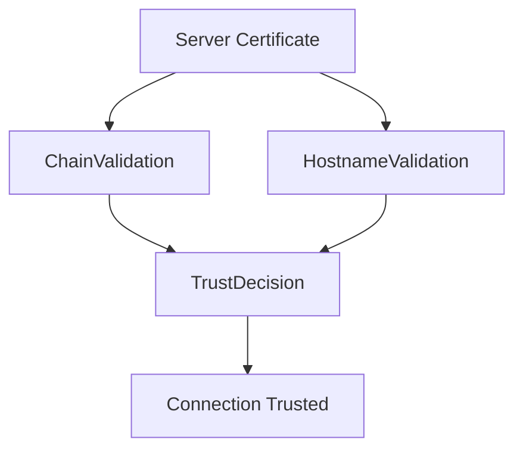
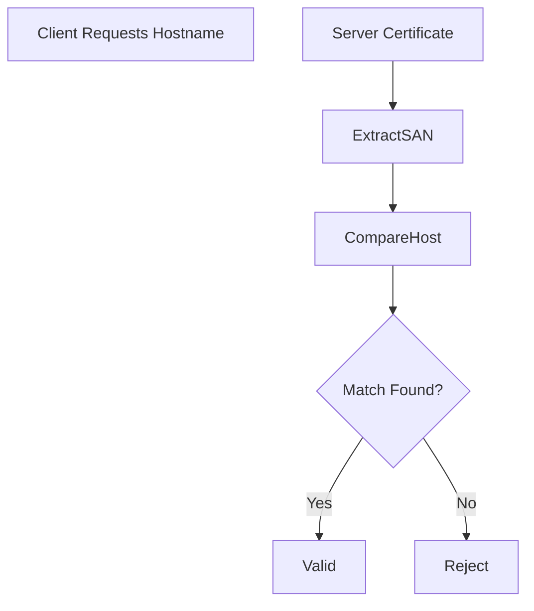
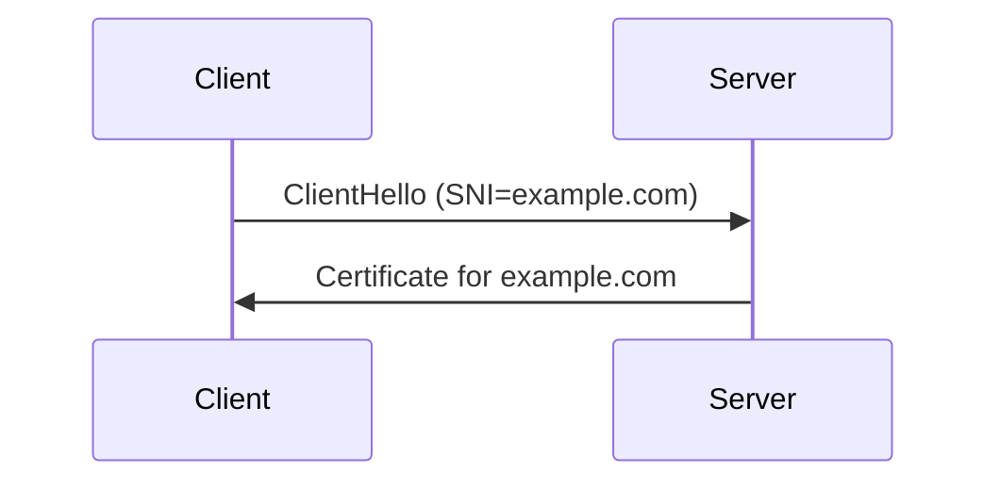

# Hostname Validation (RFC 6125)

## Overview

A common misconception about TLS is that **certificate chain validation alone proves the identity of a server**.

It does not.

Certificate chain validation only proves:

- the certificate was issued by a trusted CA
- the certificate has not expired
- the certificate chain satisfies PKI policy constraints

It does **not prove that the certificate belongs to the hostname the client intended to connect to**.

This is why TLS clients perform a **second validation step called hostname validation**, defined in **RFC 6125 — Service Identity Verification**.

Hostname validation ensures that the certificate presented by the server actually corresponds to the domain name the client requested.

Without hostname validation, a valid certificate for **any domain** could impersonate any other domain.

---

# Two Separate Validation Problems

TLS validation therefore consists of two independent checks.



Both checks must succeed.

| Validation Step | Purpose |
|----------------|--------|
| Chain validation | Verify certificate trust chain |
| Hostname validation | Verify server identity |

If either check fails, the TLS connection must be rejected.

---

# Why Hostname Validation Exists

Consider the following scenario.

A server presents a perfectly valid certificate issued by a trusted CA:

```
CN=example.com
```

But the client is attempting to connect to:

```
bank.com
```

If the client only verified the certificate chain, the connection would appear valid even though the identity does not match.

Hostname validation prevents this class of attack.

---

# Subject Alternative Name (SAN)

Modern TLS implementations perform hostname validation using the **Subject Alternative Name (SAN) extension**.

Example:

```
X509v3 Subject Alternative Name:
    DNS:example.com
    DNS:www.example.com
```

RFC 6125 specifies that clients **must use SAN if it exists**.

The older **Common Name (CN)** field should only be used as a fallback for legacy certificates.

Most modern clients no longer rely on CN at all.

---

# SAN Identity Types

SAN can contain multiple identity formats.

| Type | Example |
|-----|--------|
| DNS | example.com |
| IP | 192.168.1.10 |
| URI | spiffe://service |
| Email | admin@example.com |

For HTTPS connections, clients check the **DNS entries**.

---

# Hostname Matching Rules

RFC 6125 defines precise rules for hostname comparison.

The client must check whether the requested hostname matches one of the SAN entries.

Example:

| Hostname | Certificate SAN | Result |
|---------|----------------|-------|
| example.com | DNS:example.com | valid |
| www.example.com | DNS:www.example.com | valid |
| api.example.com | DNS:example.com | invalid |

Matching must be **exact unless wildcard rules apply**.

---

# Wildcard Certificates

Certificates may contain wildcard entries.

Example:

```
DNS:*.example.com
```

Wildcard rules are restricted to a **single label**.

Valid matches:

| Hostname | Result |
|---------|--------|
| api.example.com | valid |
| mail.example.com | valid |

Invalid matches:

| Hostname | Reason |
|---------|-------|
| example.com | wildcard does not match base domain |
| api.internal.example.com | wildcard only covers one label |

These restrictions prevent overly broad certificate usage.

---

# Internationalized Domain Names (IDN)

Domain names may include Unicode characters.

Before validation, hostnames must be converted into **Punycode form**.

Example:

```
münich.example → xn--mnich-kva.example
```

Both the certificate SAN and the requested hostname must be compared in normalized form.

Failure to normalize correctly has historically caused security issues in TLS libraries.

---

# IP Address Validation

When clients connect to a server using an IP address, the certificate must include an **IP SAN entry**.

Example:

```
IP:192.168.1.10
```

DNS SAN entries cannot be used to validate IP addresses.

Example:

| Connection Target | SAN Entry | Result |
|------------------|----------|-------|
| https://192.168.1.10 | DNS:example.com | invalid |
| https://192.168.1.10 | IP:192.168.1.10 | valid |

---

# Hostname Validation Flow

The hostname validation process can be visualized as:



The client extracts the SAN entries and checks whether any entry matches the requested hostname.

If none match, the connection must be rejected.

---

# Interaction with Server Name Indication (SNI)

Hostname validation works together with **Server Name Indication (SNI)**.

SNI allows the client to specify the hostname it intends to connect to during the TLS handshake.

Example flow:



Without SNI, servers hosting multiple domains would not know which certificate to present.

---

# Common Operational Failures

Hostname validation failures frequently occur in real infrastructure.

Typical examples:

| Problem | Cause |
|-------|------|
| hostname mismatch | incorrect SAN configuration |
| missing SAN entry | legacy certificate generation |
| wildcard misuse | incorrect domain pattern |
| IP connection failure | certificate lacks IP SAN |

Browsers typically display errors such as:

```
NET::ERR_CERT_COMMON_NAME_INVALID
```

---

# Implementation Differences

Different TLS libraries implement hostname validation differently.

| Library | Behavior |
|-------|----------|
| OpenSSL | hostname validation must be enabled explicitly |
| NSS (Firefox) | strict RFC 6125 compliance |
| Windows CryptoAPI | integrated hostname checks |
| BoringSSL | simplified validation logic |

Some legacy applications historically skipped hostname validation entirely, which created serious security vulnerabilities.

---

# Summary

Certificate chain validation confirms that a certificate is **cryptographically trusted**.

Hostname validation confirms that the certificate actually represents the **intended service identity**.

Both checks are essential.

Without hostname validation, any valid certificate issued by a trusted CA could impersonate any domain.

This separation of **trust validation** and **identity validation** is a critical design principle of TLS and modern PKI.
