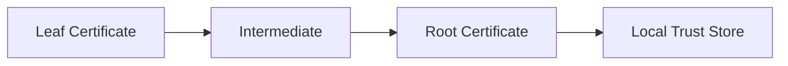

# Trust Stores and Root Programs

## Overview

The final step of certificate validation is determining whether the certificate chain terminates at a **trusted root certificate**.

Unlike other certificates in the chain, the root certificate is **not validated by another certificate**.
Instead, it is trusted because it is explicitly included in a **trust store** maintained by the operating system, browser, or application.

Trust stores are curated collections of root certificates maintained by major platform vendors. These vendors operate **root programs** that determine which Certificate Authorities (CAs) are trusted by their ecosystems.

Major root programs include:

- Mozilla Root Program
- Microsoft Trusted Root Program
- Apple Root Program
- Android CA Store

The governance and policies of these root programs effectively determine **which organizations are allowed to issue publicly trusted TLS certificates**.

---

# Trust Anchor Model

Certificate validation terminates when a chain reaches a **trust anchor**.

If the root certificate is present in the local trust store, the chain may be accepted.

If it is not present, the certificate chain is considered **untrusted**, even if the chain is otherwise cryptographically valid.

---

# Why Root Stores Exist

The global PKI system requires a way for clients to decide **which certificate authorities to trust**.

Instead of dynamically trusting any CA, systems maintain **explicit root certificate lists**.

These lists:

- define which CAs can issue publicly trusted certificates
- enforce security requirements on CAs
- allow removal of compromised or misbehaving authorities

Because every TLS client relies on these trust stores, root programs effectively control the **global TLS trust ecosystem**.

---

# Mozilla Root Program

The **Mozilla Root Program** is widely regarded as the most transparent and policy-driven root program.

Mozilla maintains the root store used by:

- Firefox
- Thunderbird
- many Linux distributions

The program publishes detailed documentation and policy requirements.

Key documents include:

- Mozilla Root Store Policy
- CA Certificate Policy
- Incident reporting requirements

### Governance Principles

Mozilla requires that CAs:

- undergo regular independent security audits
- comply with CA/B Forum Baseline Requirements
- disclose security incidents publicly

Mozilla also operates an open **bug tracker** where root inclusion and removal discussions occur.

This transparency has made Mozilla's program influential across the PKI ecosystem.

---

# Microsoft Trusted Root Program

Microsoft maintains the root store used by:

- Windows
- Microsoft Edge
- many enterprise environments

Windows uses the **CryptoAPI certificate store**, which integrates with the operating system.

Key characteristics:

- automatic root updates via Windows Update
- enterprise root store management via Group Policy
- integration with Active Directory environments

### Enterprise Root Stores

Windows environments often include **private enterprise roots** used for:

- internal TLS services
- VPN authentication
- smart card authentication
- internal PKI systems

These enterprise roots are trusted only within the organization.

---

# Apple Trust Store

Apple maintains a separate trust store used by:

- macOS
- iOS
- Safari
- iPadOS

Apple's root program includes strict operational requirements.

Certificates are managed through the **Apple Trust Store** integrated with the system keychain.

Apple enforces several security policies including:

- Certificate Transparency logging requirements
- strict certificate lifetime limits
- rapid removal of misbehaving CAs

Because iOS devices have extremely large deployment numbers, Apple policy decisions can significantly impact the PKI ecosystem.

---

# Android CA Store

Android devices maintain their own CA store.

The Android trust model includes:

- system CA store managed by Google
- optional **user-installed certificates**

Older Android versions allowed user-installed roots to be trusted by apps automatically.
Modern Android versions require apps to **explicitly opt-in** to trusting user-installed certificates.

This change significantly reduced the risk of malicious root certificates being installed on devices.

---

# Root Inclusion Governance

Root programs determine which Certificate Authorities are trusted.

The inclusion process typically requires:

1. Security audits (WebTrust or ETSI)
2. Compliance with CA/B Forum Baseline Requirements
3. Demonstrated operational maturity
4. Public documentation of issuance practices

The CA/B Forum defines many of the technical requirements for public certificate issuance.

These include:

- maximum certificate lifetimes
- minimum key sizes
- revocation requirements
- validation procedures

---

# Root Removal and Distrust

Root programs may remove CAs from trust stores if they violate security policies.

Common reasons for distrust include:

| Cause | Example |
|------|--------|
| mis-issued certificates | unauthorized domain issuance |
| audit failures | incomplete compliance reporting |
| key compromise | CA private key exposure |
| policy violations | improper validation procedures |

Several high-profile distrust events have occurred in the past, including:

- DigiNotar compromise
- Symantec PKI distrust
- TrustCor removal

These incidents demonstrate the importance of root program governance.

---

# Trust Store Differences

Different platforms may trust slightly different root sets.

Example:

| Platform | Trust Store |
|---------|------------|
| Windows | Microsoft Root Store |
| Firefox | Mozilla NSS Root Store |
| macOS | Apple Trust Store |
| Android | Android CA Store |

This means a certificate chain that validates on one platform might fail on another if the root is not present in that platform's trust store.

---

# Operational Implications

Trust store differences can cause real-world TLS issues.

Examples include:

| Scenario | Result |
|--------|-------|
| CA trusted by Mozilla but not Apple | works in Firefox but fails in Safari |
| enterprise root missing on mobile device | internal services fail on phones |
| outdated trust store | legacy devices reject modern certificates |

Large organizations often test certificate deployments against **multiple trust stores** to ensure compatibility.

---

# Summary

Trust stores are the **foundation of the global TLS trust model**.

They determine which Certificate Authorities are trusted by clients and ultimately control who is allowed to issue publicly trusted certificates.

Root programs operated by Mozilla, Microsoft, Apple, and Google enforce strict governance rules to maintain the integrity of the PKI ecosystem.

Without these curated trust stores, the security guarantees of TLS would collapse, because clients would have no reliable mechanism to determine which certificate authorities are trustworthy.
