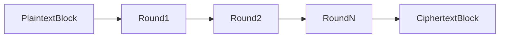
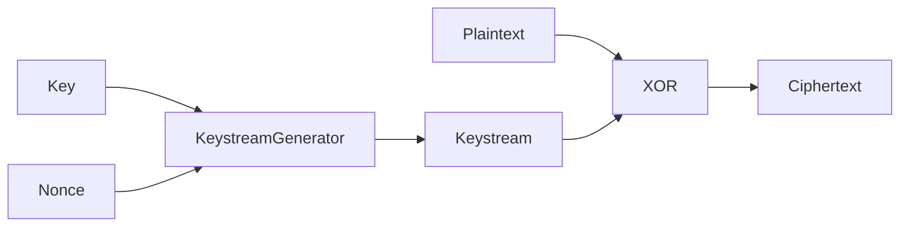
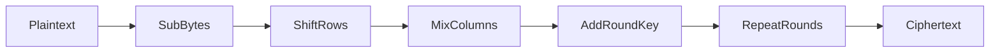
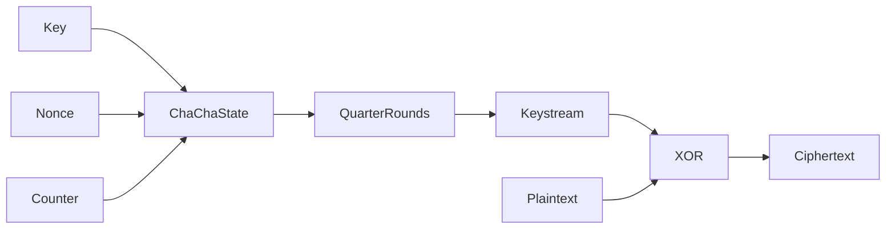

# Block Ciphers vs Stream Ciphers

Symmetric encryption algorithms fall into two major categories:

| Type          | Concept                              | Examples |
| ------------- | ------------------------------------ | -------- |
| Block cipher  | Encrypts fixed-size blocks of data   | AES      |
| Stream cipher | Encrypts data as a continuous stream | ChaCha20 |

Although both approaches achieve the same goal, their internal behavior and performance characteristics differ significantly.

## Block Ciphers

Block ciphers operate on fixed-size chunks of data.

For AES, the block size is 128 bits.

The algorithm transforms each block using a series of substitution and permutation operations that depend on the encryption key.

Simplified process:



Because data rarely aligns perfectly to block boundaries, block ciphers require modes of operation.

Examples include:

| Mode | Notes                                            |
| ---- | ------------------------------------------------ |
| CBC  | Older TLS mode, vulnerable to padding attacks    |
| GCM  | Modern AEAD mode                                 |
| CTR  | Converts block cipher into stream-like operation |

Modern TLS uses AES-GCM, which combines encryption and authentication.

## Stream Ciphers

Stream ciphers generate a keystream that is XORed with the plaintext.

```
ciphertext = plaintext XOR keystream
```

The keystream is derived from:
- secret key
- nonce
- internal state

Conceptually:



Unlike block ciphers, stream ciphers do not require padding or block alignment.

This makes them particularly efficient for:
- streaming protocols
- low-latency encryption
- systems without hardware acceleration

## AES Internals (High-Level)

AES (Advanced Encryption Standard) is the most widely deployed symmetric cipher in the world.

It is a substitution-permutation network that operates on a 128-bit block arranged as a 4×4 byte matrix called the state.

Each encryption round performs several transformations:

1. **SubBytes**
  Non-linear substitution using an S-box.

2. **ShiftRows**
  Rows of the state matrix are rotated to introduce diffusion.

3. **MixColumns**
  Columns are mixed using linear transformations over a finite field.

4. **AddRoundKey**
  The round key is XORed with the state.

Simplified structure:



AES performs:

| Key Size | Rounds |
| -------- | ------ |
| 128-bit  | 10     |
| 192-bit  | 12     |
| 256-bit  | 14     |

Despite this complexity, AES is extremely fast on modern CPUs thanks to AES-NI hardware instructions.

This hardware acceleration is one reason AES dominates TLS deployments.

## ChaCha20 Design Philosophy

ChaCha20 is a modern stream cipher designed by Daniel J. Bernstein.

Unlike AES, ChaCha20 was specifically engineered to perform well in software-only environments.

This makes it ideal for:
- mobile devices
- embedded systems
- systems without AES hardware acceleration

Instead of substitution tables like AES, ChaCha20 uses simple operations:
- addition
- XOR
- bit rotation

These operations form the ARX construction (Add-Rotate-XOR).

Simplified structure:



The design goals were:
- eliminate timing-attack risks caused by lookup tables
- ensure predictable performance across hardware
- provide strong security margins

Because of these properties, ChaCha20 is widely used in modern TLS implementations alongside AES.

---

## AES vs ChaCha20 in TLS

Modern TLS deployments typically support both algorithms.

| Cipher            | Strengths                                  |
| ----------------- | ------------------------------------------ |
| AES-GCM           | Extremely fast on CPUs with AES-NI         |
| ChaCha20-Poly1305 | Faster on systems without AES acceleration |


Browsers often select between the two dynamically depending on the client hardware.

For example:
- Desktop CPUs → AES-GCM
- Mobile devices → ChaCha20-Poly1305

This flexibility ensures consistent performance across diverse platforms.

---

## Observing Symmetric Encryption with TLSleuth

When a TLS session is established, tools such as TLSleuth can reveal the negotiated symmetric cipher.

Example:

```
Get-TLSleuthCertificate -Hostname github.com
```

Relevant output fields include:

| Field              | Meaning             |
| ------------------ | ------------------- |
| CipherAlgorithm    | Symmetric algorithm |
| CipherStrength     | Key length          |
| NegotiatedProtocol | TLS version         |

Example output:

```
NegotiatedProtocol : Tls13
CipherAlgorithm    : Aes256
CipherStrength     : 256
```

## Key Insight

The most important architectural insight is this:

> Symmetric encryption protects the data, but asymmetric cryptography enables it.

TLS uses asymmetric cryptography only long enough to establish a shared secret.

After that point, the entire session relies on symmetric encryption to deliver both security and performance.


