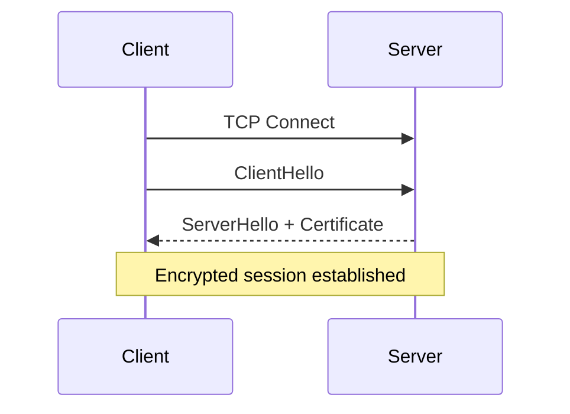
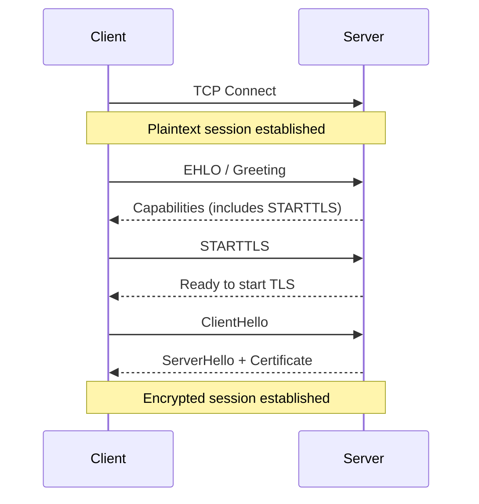
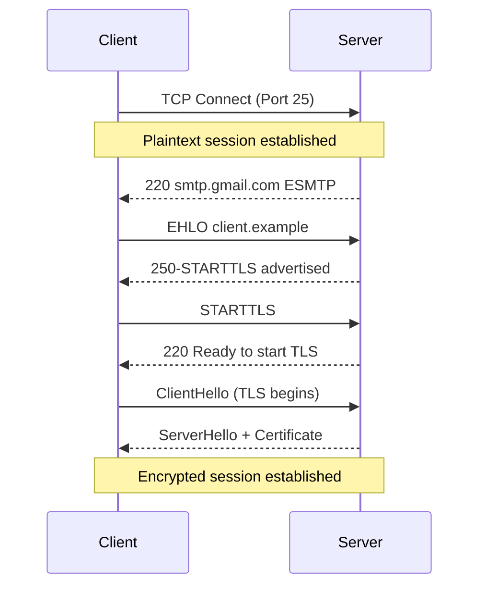
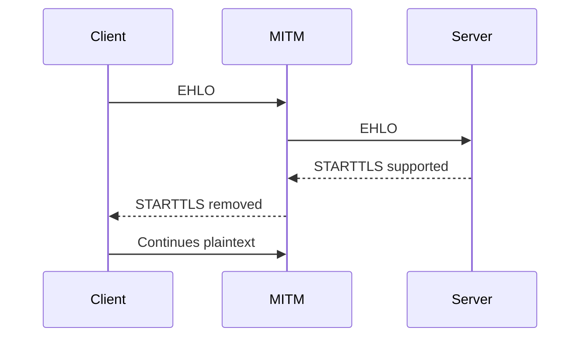
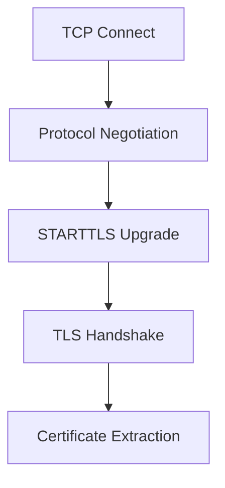

## Implicit vs Explicit TLS

TLS does not always begin the same way.

Some protocols negotiate encryption immediately upon connection. Others begin in plaintext and upgrade later. The difference is architectural, historical, and security-relevant.

This post analyzes implicit TLS vs explicit TLS (STARTTLS) from a protocol, security, and operational perspective — and ties those concepts directly to tooling such as TLSleuth.

---

## 1. Two Ways TLS Begins

### Implicit TLS

TLS starts immediately after TCP connection establishment.



Examples:

| Protocol | Port |
|----------|------|
| HTTPS | 443 |
| SMTPS | 465 |
| IMAPS | 993 |
| POP3S | 995 |
| LDAPS | 636 |
| MQTT over TLS | 8883 |

> Operationally: wrap `SslStream` immediately after TCP connect.

---

### Why Implicit TLS Is Simpler for Tooling

For implicit TLS, a client does **not need to understand the application protocol at all** in order to retrieve the certificate.

After TCP connect, the client can immediately initiate a TLS handshake.

In .NET / PowerShell, a minimal conceptual flow:

- Perform `TcpClient.Connect()`
- Immediately create `SslStream`
- Perform handshake `AuthenticateAsClient()`
- Extract `RemoteCertificate`

Pseudo-flow in Powershell terms:

```powershell
# Create TCP connection
$tcpClient = [System.Net.Sockets.TcpClient]::new()
$tcpClient.Connect($hostname, $port)

# Create SslStream
$sslStream = [System.Net.Security.SslStream]::new(
    $tcpClient.GetStream(),
    $false,  # leaveInnerStreamOpen
    { $true } # RemoteCertificateValidationCallback (accept for inspection)
)

# Perform TLS handshake
$sslStream.AuthenticateAsClient($hostname)

# Extract the remote certificate
$remoteCert = [System.Security.Cryptography.X509Certificates.X509Certificate2]::new(
    $sslStream.RemoteCertificate
)
```

No IMAP parsing. No SMTP negotiation. No protocol awareness required.

TLSleuth leverages exactly this property for implicit transports.

Example:

```powershell
# Get certificate details from Google IMAPS server
Get-TLSleuthCertificate -Hostname imap.gmail.com -Port 993
```

The IMAP protocol itself is irrelevant at this stage.

This is a key architectural advantage of implicit TLS.

---

### Explicit TLS (STARTTLS)

The connection begins in plaintext. TLS is negotiated via a protocol command.



Examples:

| Protocol | Port |
|----------|------|
| SMTP | 25 / 587 |
| IMAP | 143 |
| POP3 | 110 |
| FTP | 21 |
| LDAP | 389 |
| XMPP | 5222 |

---

### Explicit TLS and Transport Awareness in TLSleuth

Unlike implicit TLS, explicit TLS requires the client to understand enough of the application protocol to safely transition from plaintext to encrypted communication.

With STARTTLS-based protocols, TLS does not begin immediately after TCP connect. The client must:

- Establish TCP connection
- Read the server greeting
- Negotiate capabilities
- Confirm STARTTLS is supported
- Issue the STARTTLS command
- Validate the server response
- Upgrade the connection to `SslStream`
- Perform TLS handshake
- Extract certificate metadata

This introduces protocol-specific logic into what would otherwise be a generic TLS inspection pipeline.

---
### SMTP STARTTLS Flow (Operational View)


### How TLSleuth Handles Explicit TLS

For SMTP, TLSleuth implements a transport called `SmtpStartTls`

```powershell
Get-TLSleuthCertificate `
    -Hostname smtp.gmail.com `
    -Port 25 `
    -Transport SmtpStartTls
```

Internally, the flow differs significantly from implicit TLS.

```powershell
# Create TCP connection
$tcpClient = [System.Net.Sockets.TcpClient]::new()
$tcpClient.Connect($hostname, 25)

# use SmtpStartTls for basic SMTP Parsing
# 1. Read server greeting
# 2. Send EHLO
# 3. Parse capabilities
# 4. Confirm STARTTLS is advertised
# 5. Send STARTTLS
# 6. Wait for 220 Ready response

# Only after successful upgrade:

# Create SslStream
$sslStream = [System.Net.Security.SslStream]::new(
    $tcpClient.GetStream(),
    $false,
    { $true }
)

# Perform TLS handshake
$sslStream.AuthenticateAsClient($hostname)

# Extract the remote certificate
$remoteCert = [System.Security.Cryptography.X509Certificates.X509Certificate2]::new(
    $sslStream.RemoteCertificate
)
```

The critical difference is that `SslStream` cannot be created until the protocol upgrade has been negotiated successfully.

This means TLSleuth must:
- Parse SMTP responses correctly
- Handle multi-line capability advertisements
- Fail safely if STARTTLS is not supported
- Detect downgrade conditions
- Avoid attempting TLS on a plaintext-only connection
- The tool now requires partial protocol awareness.


## 2. Historical Context — Why STARTTLS Exists

SMTP (1982) was plaintext-only. Encryption was added later without breaking global interoperability.

Backward compatibility drove STARTTLS adoption. Introducing mandatory TLS-only ports would have fragmented the ecosystem.

Implicit TLS (e.g., SMTP 465) was introduced, deprecated, and later reintroduced because operators preferred strict encryption semantics.

Architectural tension:

> Backward compatibility vs cryptographic enforcement.

---

## 3. Architectural Comparison

| Characteristic | Implicit TLS | Explicit TLS |
|---------------|--------------|--------------|
| Encryption begins | Immediately | After negotiation |
| Plaintext phase | None | Yes |
| Downgrade risk | Low | Higher |
| Compatibility | Lower | Higher |
| Implementation complexity | Lower | Higher |

---

## 4. Downgrade Risk — STARTTLS Stripping

Explicit TLS introduces a downgrade surface.



If the client does not strictly require TLS, encryption can be silently bypassed.

Mitigations include:

- MTA-STS
- DANE
- Strict transport enforcement
- Refusing plaintext fallback

Implicit TLS avoids this negotiation-layer attack vector entirely.

---

## 5. TLSleuth and Transport Awareness

A naïve TLS inspection tool assumes:

TCP → TLS handshake

This fails on explicit TLS ports.

Correct usage examples:

```powershell
## Implicit TLS
Get-TLSleuthCertificate -Hostname imap.gmail.com -Port 993

## Explicit TLS (SMTP STARTTLS)
Get-TLSleuthCertificate `
    -Hostname smtp.gmail.com `
    -Port 25 `
    -Transport SmtpStartTls
```

TLSleuth must:

1. Connect via TCP
2. Perform protocol-specific negotiation
3. Issue STARTTLS
4. Upgrade to SslStream
5. Extract certificate



Implicit TLS skips the negotiation stage entirely.

---

## 6. Operational Implications

When troubleshooting:

- Does the server advertise STARTTLS?
- Is TLS required or optional?
- Are implicit and explicit ports configured differently?
- Is STARTTLS being stripped by a middlebox?

Security scanners that assume “open port → attempt TLS” will misclassify STARTTLS-enabled services as non-TLS.

Transport-aware tooling is required.

---

## 7. Non-Obvious Engineering Trade-Offs

- STARTTLS increases protocol parsing complexity.
- Two-phase state machines increase bug surface.
- Implicit TLS simplifies validation logic.
- SMTP federation realities prevent strict TLS enforcement globally.

Encryption design decisions were shaped by availability pressures.

---

## Conclusion

Implicit TLS and explicit TLS are not interchangeable.

Implicit TLS enforces encryption from the first byte.
Explicit TLS preserves compatibility while enabling encryption.

STARTTLS persists because distributed systems demand interoperability.

For infrastructure engineers and security architects, understanding this distinction is essential for:

- Accurate TLS inspection
- Downgrade risk assessment
- Production troubleshooting
- Secure service design

TLS does not always start the same way — and that difference still matters.
