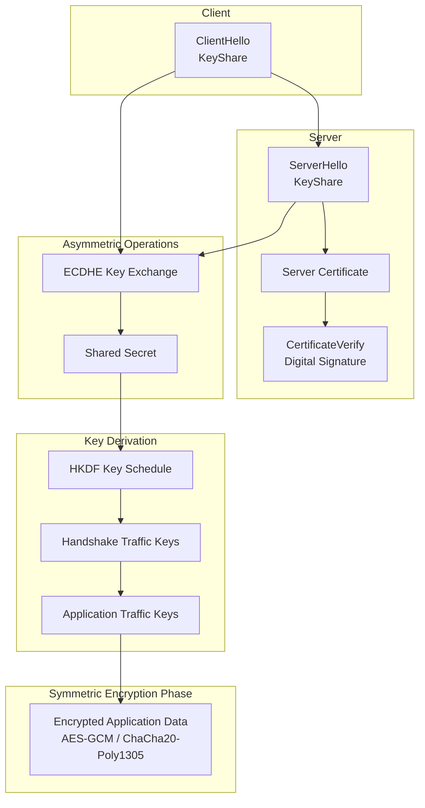

# Hybrid TLS Cryptographic Model

This diagram visually seperates:

1. Handshake authentication (signatures / certificates)
2. Key agreement (ECDHE)
3. Key derivation (HKDF)
4. Switch to symmetric encryption



## What This Diagram Shows

This diagram highlights one of the most important architectural design choices in TLS:

| Phase          | Cryptography Used       | Purpose                       |
| -------------- | ----------------------- | ----------------------------- |
| Handshake      | Asymmetric cryptography | Authentication + key exchange |
| Key derivation | Hash functions / HKDF   | Generate session keys         |
| Data transfer  | Symmetric encryption    | Efficient data protection     |


The sequence works like this:
1. The client connects and begins the TLS handshake.
2. The server presents its certificate, which is verified using digital signatures.
3. The client and server perform a key exchange (typically ECDHE).
4. Both parties derive the same shared secret.
5. Session keys are derived from that secret.
6. All application traffic is then encrypted using symmetric encryption.

---

## Why TLS Uses This Hybrid Model

Each cryptographic primitive solves a different problem:

| Primitive               | Problem Solved                              |
| ----------------------- | ------------------------------------------- |
| Asymmetric cryptography | Secure identity verification                |
| Key exchange            | Establish shared secret                     |
| Hash functions          | Derive keys and protect handshake integrity |
| Symmetric encryption    | Efficient data encryption                   |

Using asymmetric cryptography for all traffic would be far too slow.

Instead, TLS uses asymmetric cryptography only long enough to establish a symmetric session key.

---

## How This Appears in TLSleuth

Tools like TLSleuth reveal the symmetric portion of this architecture.

Example:

```
Get-TLSleuthCertificate -Hostname github.com
```

Typical output:

```
NegotiatedProtocol : Tls13
CipherAlgorithm    : Aes256
CipherStrength     : 256
```

This shows the symmetric encryption algorithm protecting the session.

The asymmetric operations that established the key occurred earlier during the handshake
