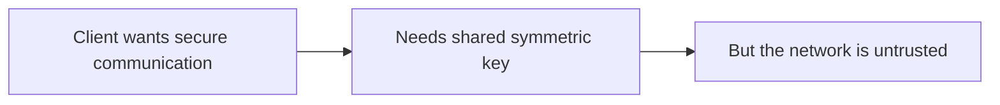
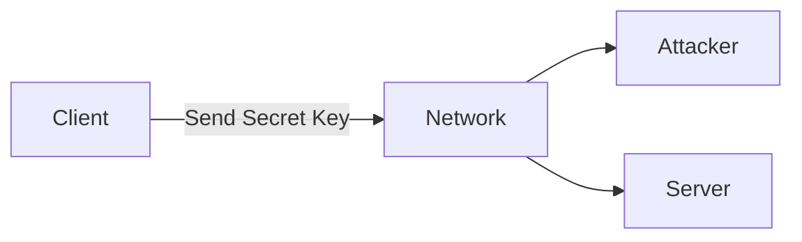
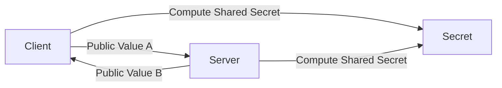
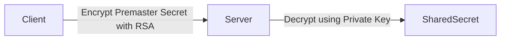
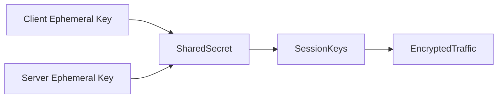
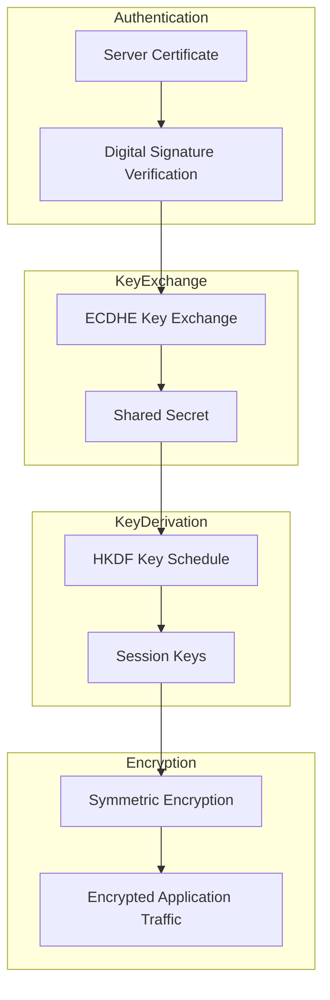

# Key Exchange and Forward Secrecy

> **Series:** TLS & Certificate Infrastructure Deep Dive

In **Part 1** of this series we explored the cryptographic primitives that underpin secure communication:

- hash functions
- symmetric encryption
- asymmetric cryptography
- digital signatures
- authenticated encryption (AEAD)

However, these primitives alone do not solve one of the most fundamental problems in cryptography:

> **How do two systems securely agree on a shared secret across an untrusted network?**

This problem is known as the **key distribution problem**, and solving it is the core purpose of modern TLS handshakes.

This article explores how modern protocols solve this challenge using **Diffie‑Hellman key exchange, elliptic curve cryptography, and forward secrecy**.

---

# 1. The Key Distribution Problem

Symmetric encryption is extremely fast and ideal for protecting large volumes of data.

However it has a major limitation:

> Both parties must already possess the same secret key.

If two systems want to communicate securely using symmetric encryption, they must somehow exchange that key **before communication begins**.

That raises an immediate problem:



Sending the key directly across the network would allow an attacker to intercept it.



If the attacker obtains the symmetric key, they can decrypt every message.

This means symmetric encryption alone **does not scale to open networks like the internet**.

A new mechanism was needed — one that allowed two systems to derive a shared secret **without transmitting that secret directly**.

That mechanism was invented in 1976.

---

# 2. Diffie‑Hellman Key Exchange

The Diffie‑Hellman key exchange algorithm solved the key distribution problem in an elegant way.

It allows two parties to:

- exchange **public values**
- derive the **same shared secret**
- without ever transmitting the secret itself.

Even if an attacker observes all network traffic, they cannot compute the shared secret.

Conceptually the process looks like this.



Both parties perform a mathematical operation combining:

- their private value
- the other party's public value

The result is the same shared secret.

An attacker observing the exchange sees only the public values.

Computing the shared secret from those values would require solving a **discrete logarithm problem**, which is computationally infeasible for properly chosen parameters.

Diffie‑Hellman therefore allows a shared key to be established **over a completely insecure channel**.

---

# 3. Elliptic Curve Diffie‑Hellman

Classic Diffie‑Hellman uses arithmetic over large prime numbers.

While secure, it requires relatively large key sizes.

Modern TLS implementations prefer **Elliptic Curve Diffie‑Hellman (ECDH)**.

Elliptic curve cryptography provides equivalent security with far smaller keys.

| Algorithm | Typical Key Size |
|-----------|------------------|
| RSA | 2048–4096 bits |
| Diffie‑Hellman | 2048+ bits |
| ECDH | ~256 bits |

This reduction provides several advantages:

- faster key exchange
- lower CPU overhead
- smaller handshake messages

These benefits are particularly important for:

- mobile devices
- high‑scale web services
- low‑latency applications

Modern TLS versions therefore use **ECDHE** (Elliptic Curve Diffie‑Hellman Ephemeral) by default.

---

# 4. Forward Secrecy

Early TLS versions used a different approach.

Instead of Diffie‑Hellman, the client generated a **premaster secret** and encrypted it with the server's RSA public key.



This worked, but it had a serious flaw.

If the server's private key was ever compromised, an attacker could decrypt **all previously recorded TLS sessions**.

This meant historical traffic could be retroactively decrypted.

Forward secrecy was introduced to solve this problem.

With **ephemeral Diffie‑Hellman**, each TLS session generates temporary keys.



Once the session ends, the ephemeral keys are discarded.

Even if the server's certificate key is later compromised, past sessions remain secure.

Forward secrecy is therefore a critical property for long‑term confidentiality.

TLS 1.3 requires ephemeral key exchange for every session.

---

# 5. How TLS Combines These Primitives

TLS combines several cryptographic mechanisms to establish a secure connection.

The sequence looks like this:

1. **Certificate authentication** verifies server identity.
2. **Diffie‑Hellman key exchange** produces a shared secret.
3. **Key derivation functions** generate session keys.
4. **Symmetric encryption** protects application traffic.



The handshake therefore transitions from:

**asymmetric cryptography → symmetric encryption**.

This hybrid model delivers both security and performance.

---

# 6. Mapping Cryptography to Real TLS Sessions

Tools like **TLSleuth** allow engineers to observe the results of TLS negotiation.

Example:

```powershell
Get-TLSleuthCertificate -Hostname github.com
```

Typical output:

```text
NegotiatedProtocol            : Tls13
CipherAlgorithm               : Aes128
CipherStrength                : 128
NegotiatedCipherSuite         : TLS_AES_128_GCM_SHA256
```

These fields correspond to the primitives used during the handshake.

| TLSleuth Field | Meaning   |
| ------------------------- | ----------------------------- |
| **NegotiatedProtocol**    | TLS protocol version negotiated during the handshake (e.g., TLS 1.2, TLS 1.3).  |
| **CipherAlgorithm**  | The symmetric encryption algorithm used to protect application traffic (e.g., AES).  |
| **CipherStrength**   | The key size of the symmetric encryption algorithm (e.g., 128-bit or 256-bit).  |
| **NegotiatedCipherSuite** | The full TLS cipher suite selected during the handshake. This defines the cryptographic parameters used for the session, including the symmetric encryption algorithm, authentication mechanism, and hash function used for key derivation and integrity. |


Although the key exchange itself is not always visible directly, the negotiated cipher suite implies which key exchange method was used.

Understanding this mapping helps engineers troubleshoot issues such as:

- TLS handshake failures
- cipher negotiation problems
- performance bottlenecks

---

# 7. Architectural Lessons

TLS has evolved significantly over time.

Several important design lessons emerged from that evolution.

### Static RSA Key Exchange Was Removed

TLS 1.3 removed RSA key exchange entirely because it lacked forward secrecy.

### Ephemeral Key Exchange Is Now Mandatory

Every TLS 1.3 session uses ephemeral Diffie‑Hellman.

This guarantees forward secrecy for all modern TLS traffic.

### AEAD Became the Standard

Legacy CBC cipher modes introduced subtle cryptographic vulnerabilities.

Modern TLS uses authenticated encryption such as:

- AES‑GCM
- ChaCha20‑Poly1305

### Forward Secrecy Matters

Forward secrecy protects historical data even if long‑term keys are compromised.

For systems handling sensitive data, this property is essential.

---

# Conclusion

Key exchange mechanisms solve one of the hardest problems in cryptography: securely establishing a shared secret across an untrusted network.

Diffie‑Hellman and its elliptic curve variants allow modern protocols like TLS to derive session keys without ever transmitting them.

Combined with digital certificates and symmetric encryption, these mechanisms form the foundation of secure internet communication.

In the next part of this series we will explore **X.509 certificates and Public Key Infrastructure (PKI)** — the systems that allow clients to trust the identities presented during the TLS handshake.
