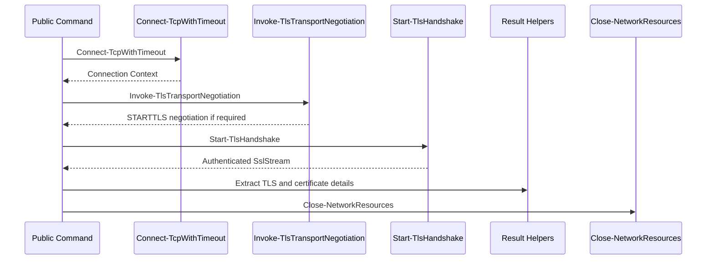

# Simplifying TLS Connection Orchestration

In versions **2.3.1 and 2.3.2**, TLSleuth introduced internal architecture refactors designed to simplify orchestration logic and reduce duplication across helpers while keeping the public API unchanged.

The refactor focused on two areas:

1. A shared **connection context model** to simplify internal helper APIs.
2. **Centralized transport negotiation logic** for STARTTLS‑style protocols.

---

# The Problem This Refactor Solves

Before these updates, internal helper functions often required multiple connection-related parameters:

- `TcpClient`
- `NetworkStream`
- `SslStream`

These resources were passed individually through multiple call paths. While functional, this approach created several issues:

- Internal APIs duplicated connection resource parameters across many helpers.
- Transport negotiation logic for protocols such as SMTP, IMAP, and POP3 existed directly inside public command bodies.
- STARTTLS dispatch behavior had to be repeated in multiple places.

This increased orchestration complexity and made the code harder to maintain.

---

# What Changed in 2.3.1

Version **2.3.1** introduced a shared **connection context object** used internally throughout TLSleuth.

```powershell
[PSCustomObject]@{
    TcpClient     = <tcp>
    NetworkStream = <stream>
    SslStream     = <ssl-or-null>
}
```

This object represents the lifecycle of a single TLS connection.

Helpers such as:

- `Start-TlsHandshake`
- `Get-TlsHandshakeDetails`
- `Get-RemoteCertificate`
- `Close-NetworkResources`

now operate directly on the connection context.

`Start-TlsHandshake` creates the `SslStream` from `Connection.NetworkStream`, performs the TLS handshake, and stores the authenticated stream in `Connection.SslStream`.

This centralizes ownership of connection resources and eliminates repeated parameter passing.

---

# What Changed in 2.3.2

Version **2.3.2** centralized STARTTLS transport negotiation.

A new private helper was introduced:

`source/private/Invoke-TlsTransportNegotiation.ps1`

This helper routes negotiation behavior based on the transport:

- `ImplicitTls`
- `SmtpStartTls`
- `ImapStartTls`
- `Pop3StartTls`

Another helper was introduced:

`source/private/Invoke-StartTlsNegotiation.ps1`

Protocol‑specific helpers (`Invoke-SmtpStartTlsNegotiation`, `Invoke-ImapStartTlsNegotiation`, `Invoke-Pop3StartTlsNegotiation`) now act as thin wrappers around the shared negotiation logic.

This removes STARTTLS branching logic from the public commands.

---

# Internal Orchestration Flow

The simplified execution flow is now:

1. Connect to the remote endpoint.
2. Perform transport negotiation if required.
3. Perform the TLS handshake.
4. Extract TLS and certificate information.
5. Close connection resources.



---

# Public Behavior Remains Unchanged

These refactors are entirely internal.

Public commands behave exactly the same.

Example commands:

```powershell
Get-TLSleuthCertificate -Hostname smtp.gmail.com -Port 587 -Transport SmtpStartTls
```

```powershell
Get-TLSleuthCertificate -Hostname outlook.office365.com -Port 143 -Transport ImapStartTls
```

```powershell
Test-TLSleuthProtocol -Hostname github.com |
    Select Protocol, ConnectionSuccessful, NegotiatedProtocol, ErrorMessage
```

Scripts and automation pipelines continue to work without modification.

---

# Testing and Validation

Unit tests cover the updated orchestration and transport dispatch logic:

- `Close-NetworkResources.Tests.ps1`
- `Get-TLSleuthCertificate.Transport.Tests.ps1`
- `Test-TLSleuthProtocol.Tests.ps1`

Integration tests verify real protocol negotiation:

- `Start-TlsHandshake.Get-RemoteCertificate.Tests.ps1`
- `Invoke-SmtpStartTlsNegotiation.Tests.ps1`
- `Invoke-ImapStartTlsNegotiation.Tests.ps1`
- `Invoke-Pop3StartTlsNegotiation.Tests.ps1`

Example test run:

```powershell
Invoke-Pester -Path source/tests -Output Detailed
```

---

# Operational Considerations

This refactor does **not add new capabilities**.

TLS results still depend on:

- OS TLS configuration
- .NET runtime capabilities
- Server configuration

STARTTLS support remains dependent on server and protocol behavior.

`SkipCertificateValidation` behavior remains unchanged.

---

# Summary

TLSleuth **2.3.1 and 2.3.2** introduce internal architecture improvements that simplify connection orchestration while preserving the public interface.

Key improvements:

- Shared **connection context object**
- Centralized **transport negotiation**
- Cleaner **command orchestration**
- Reduced **internal code duplication**

For users, nothing changes.
For maintainers, the codebase becomes significantly easier to extend and maintain.
